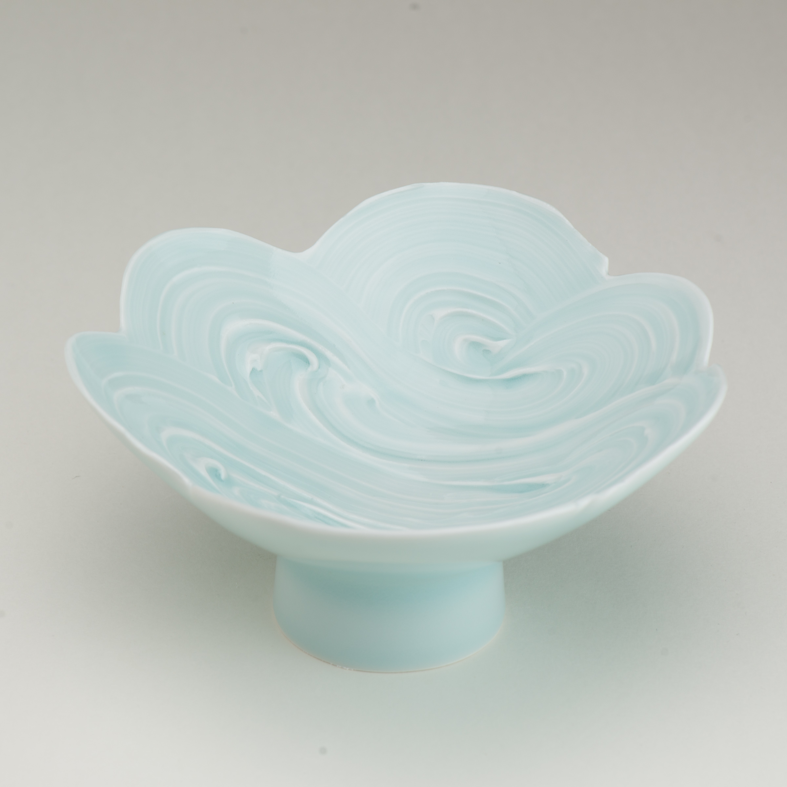

The history of ceramic slip decoration reaches far back into antiquity.  Much as ancient pottery emulated more valuable vessels in precious metals, white slips were often applied to darker clay bodies in an effort to increase “value”.  Many inventive uses for slips have evolved through the centuries, such as Cizhou black and white slip carving, Chinese “cut-glaze” slip with resist patterns, Korean slip inlay and reverse inlay patterns, and the dramatic _hakeme_ brushed slips of Japan.

Similar to _hakeme,_ the _Painted_ series uses brushes to apply slip.  But _Painted_ removes the “ground” of the underlying thrown form, leaving behind only the slip.  Thus the decoration determines the shape of the vessel—the form is _painted_.

Dish. One-stroke form, five lobes. 30cm dia, 8.5cm high. Porcelain with celadon glaze.

    
    Dish. One-stroke form, six lobes. 33cm dia, 8cm high. Porcelain with celadon glaze.
    

    
    Side view of One-stroke form, five lobes.
    

    
    Small one-stroke dish
    

    
    Side view of small one-stroke dish
    

    
    One-stroke porcelain form at leather-hard stage.
    

    
    Detail of one-stroke porcelain form at leather-hard stage.
    

    
    Brushtroke dish
    

    
    Brushstroke dish, side view
    

Detail of brushstroke dishes

    
    Side view of short-brushstroke dish
    

    
    Detail of short-brushstroke dish
    

    
    Short-brushstroke cup
    

    
    Short-brushstroke cup
    

Detail of short-brushstroke cup

    
    Swirl stemdish
    

    
    Side view of swirl stemdish
    

    
    Lobed bowl
    

    
    Side view of lobed bowl
    

Detail of lobed bowl

Detail of floral brushed slip decoration

Detail of translucency after firing.

    

    

    

    
    Detail of lobed bowl
    

    
    Side view of floral bowl
    

    
    Detail of floral bowl
    

    
    Lobed bowl
    

    
    Side view of lobed bowl
    

    
    Detail of lobed bowl
    

    
    Open lobed bowl
    

    
    Side view of open lobed bowl
    

    
    Lobed bowl
    

    
    Side view of lobed bowl
    

    
    Small floral bowl
    

    
    Side view of small floral bowl
    

    
    Large painted bowl
    

    
    Side-view of large painted bowl
    

Detail of large painted bowl

    
    Floral dish
    

    
    Side view of floral dish
    

    
    Detail of floral dish
    

    
    Lobed dish. 25cm dia, 6cm height. Porcelain with celadon glaze.
    

    
    Side view of lobed dish.
    

    
    Detail of brushwork on lobed dish.
    

    
    Lobed stem dish. 20cm dia, 9.5cm height. Porcelain with celadon glaze.
    

    
    Side view of lobed stem dish.
    

    
    Detail of brushwork on lobed stem dish.
    

    
    Large floral dish
    

    
    Large floral dish
    

    
    Song-style dish. 25cm dia, 6.5cm height. Porcelain with celadon glaze.
    

    
    Side-view of Song-style dish
    

    
    Plate with floral interior
    

    
    Plate with floral rim
    

    
    Painted cup
    

    
    Painted cup
    

    
    Painted cup
    

    
    Painted cup
    

    
    Painted cup
    

    
    Detail of painted cup
    

    
    Painted cup
    

    
    Detail of painted cup
    

    
    Painted cup
    

    
    Detail of painted cup
    

This work was made for [Arrowmont’s Utilitarian Clay Symposium](http://www.arrowmont.org/visit/events/) and [The Signature Shop’s Design + Crafted Exhibition](https://www.thesignatureshop.com/exhibitions-events/).

    

