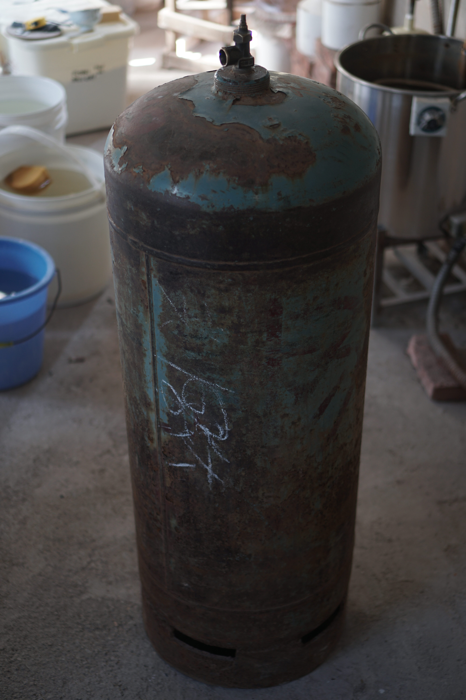
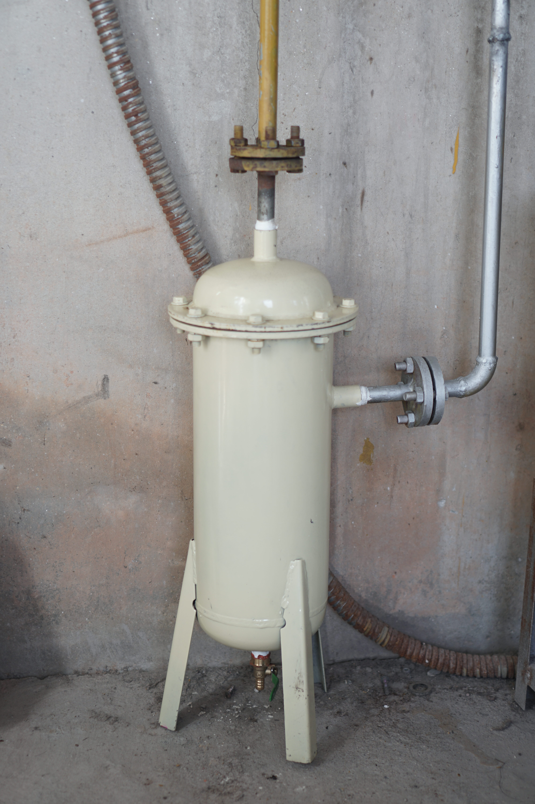

_This page is in progress and will cover my kiln and firing.  For now it is just a place to store my notes._

    
    A typical 47kg/100lbs LPG propane tank used for firing gas kilns. Depending upon firing style, a small kiln requires 1 to 1 1/2 tanks per firing.
    

    
    The older bottles can be very dangerous. Sometimes the top pressure-release valves leak, even after closing.
    

The older bottles can be very dangerous. Sometimes the top pressure-release valves leak, even after closing.

    
    In my experience, the hose connector is the most likely point of failure. Earlier models of hoses were just rubber and would start leaking at the connector after about 2 years of use. The rubber cap ring must also be regularly replaced.
    

    
    The first gauge measuring pressure directly from the tanks. Newly-filled tank pressure usually varies from anywhere between 0.2-0.6 MPa.
    

Electric water heater and gas filter.

    

    

    

    

    
    LPG filter. At the bottom there is a release valve which should be periodically opened under pressure in order to eject the build-up. Too much build up in the filter can result in leaks in the filter and/or dirty gas making it's way to the kiln.
    

    
    Typical gas line connector. Inside each end is a rubber collar and plate that under pressure should eliminate leaks.
    

    
    The pressure regulator reduces the gas pressure to a level we can use in the kiln burners. I have mine set at 0.05 MPa.
    

    

    
    Gauge measuring outgoing pressure from regulator.
    

    
    Kiln room valves. The bottom lever valve can be used for coarse adjustment, while the top (needle?) valve is good for fine-tuning.
    

    
    The final gauge measuring pressure at the kiln. A typical firing rarely goes above 0.02MPa.
