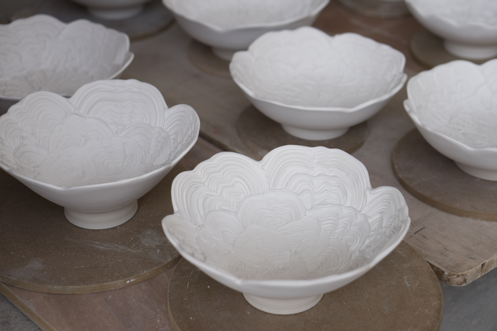

Work usually slows to a crawl during Winter in Jingdezhen.  Although it rarely dips below freezing, the weather is very wet.  Apart from the fact that it is quite uncomfortable to work in unheated studios, clay also dries slowly.  On the rare sunny days one can find balconies filled with drying porcelain as well as heavy blankets being aired out.

