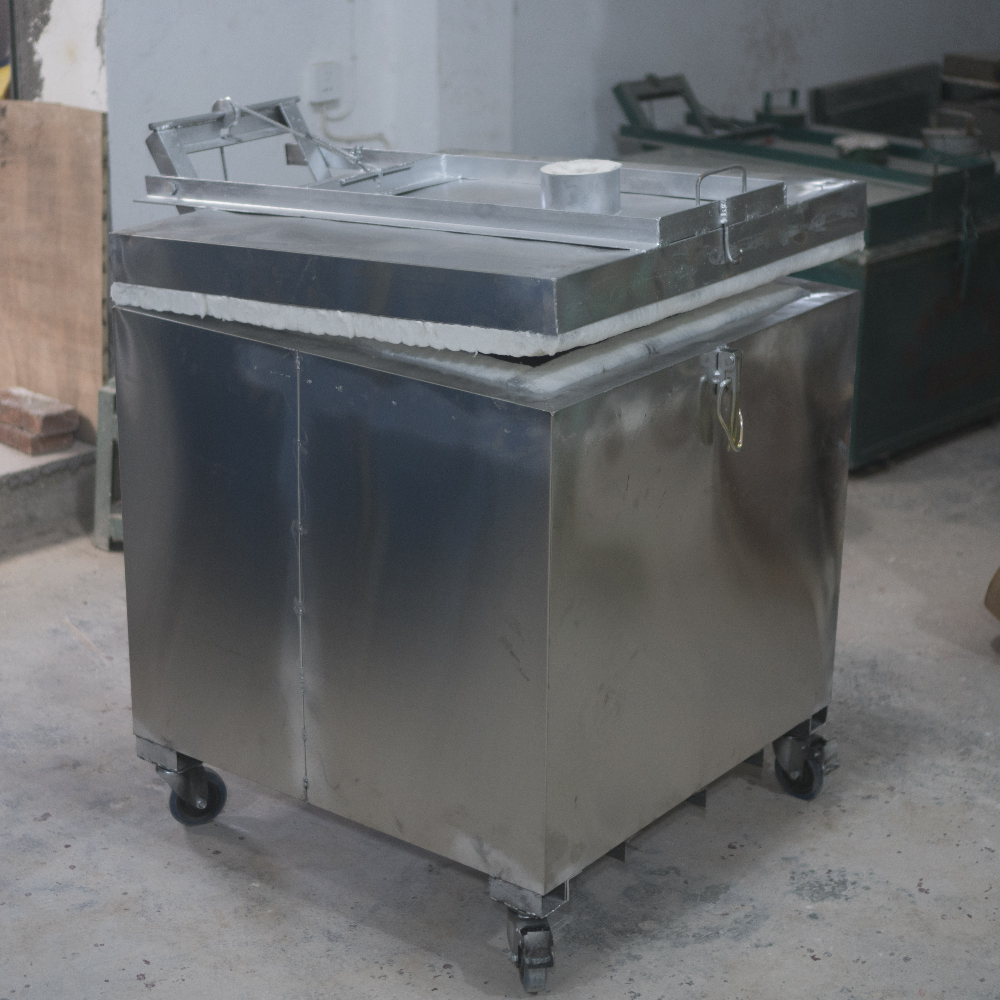
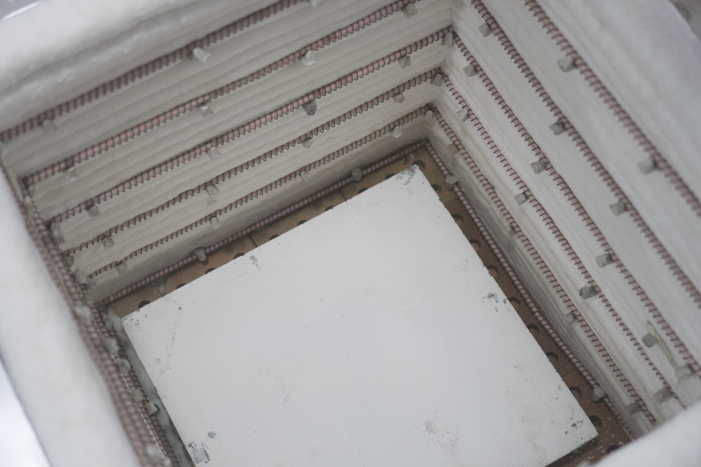
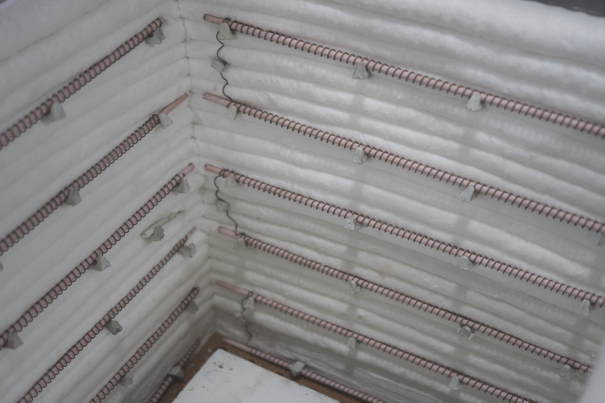
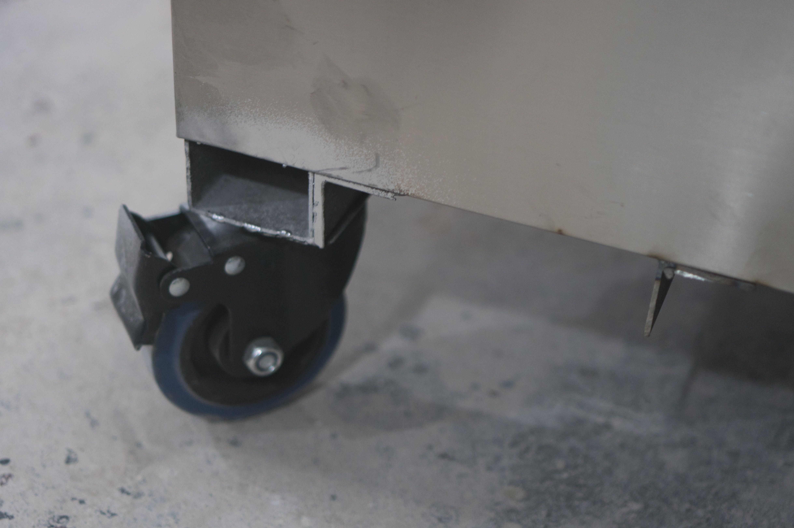
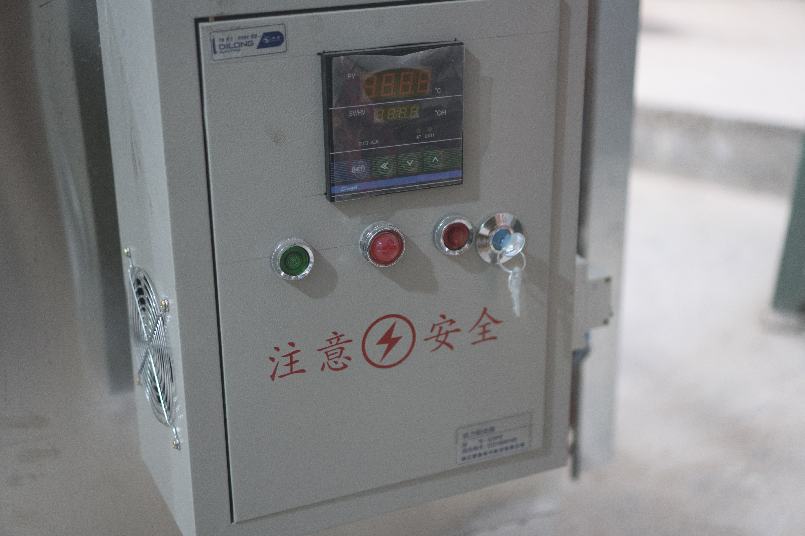
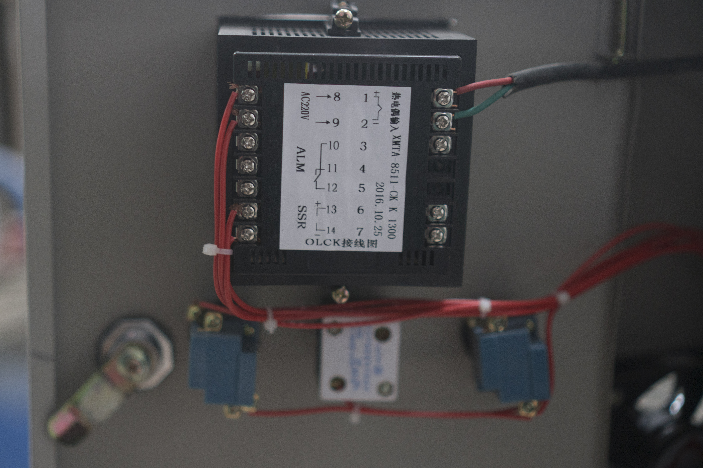
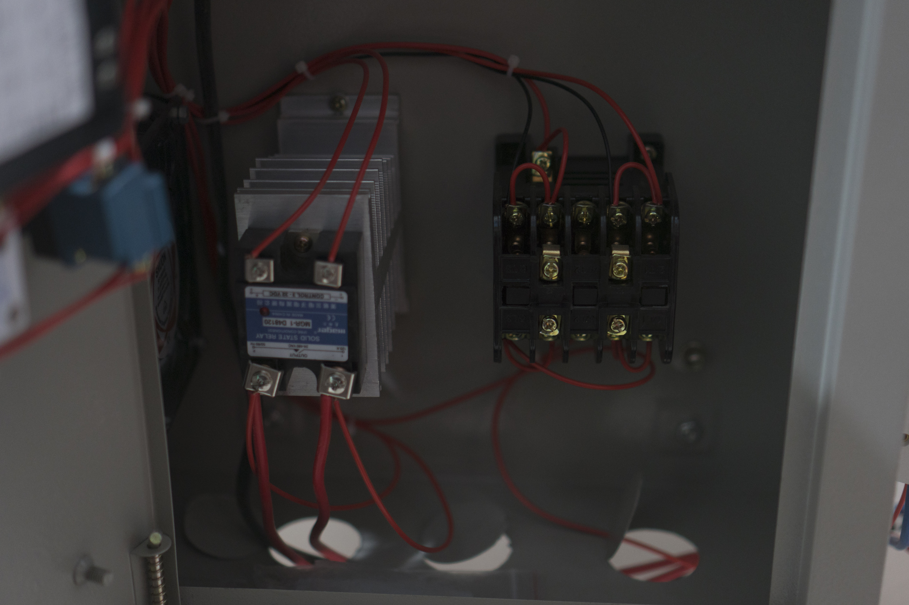
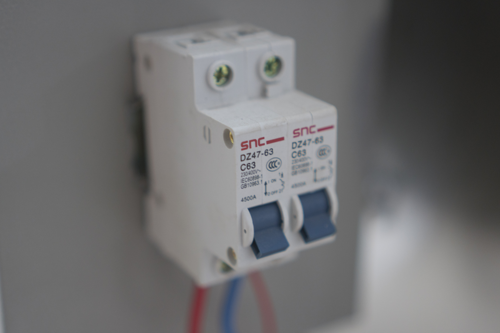
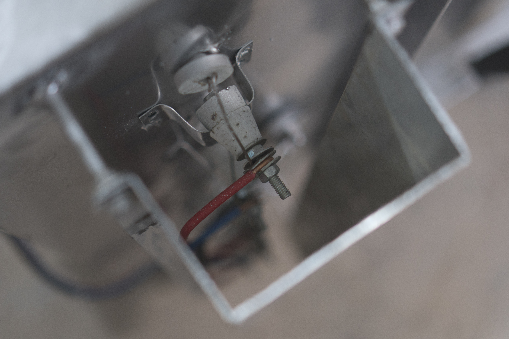
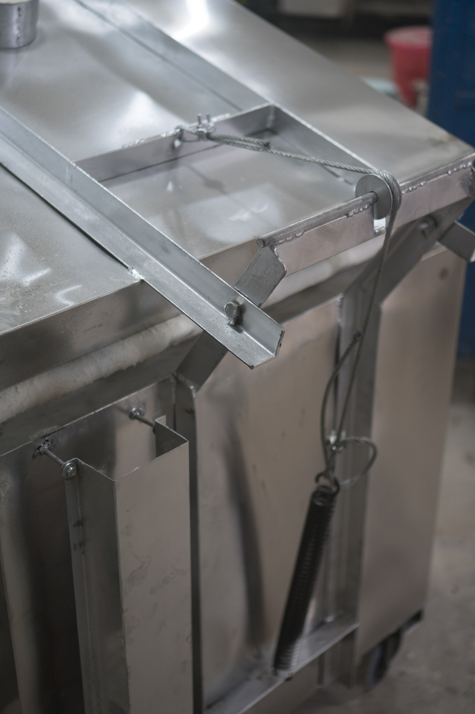

I've finally gotten a new low-fire electric kiln. This kiln is designed to fire up to 1000°C, so it's useful only for on-glaze enamels and bisque. Total cost was 2900RMB, which is about $420USD.

    
    The kiln uses 45cm X 50cm shelves, a common size here.
    

    
    Elements are also snaked through the bottom of the kiln, on top of which are placed bricks.
    

    
    Single K-type thermocouple placed in the middle of the kiln.
    

    
    Locking wheels, really handy.
    

    
    Control box.
    

    

    

    

    
    Element connectors
    

    
    Spring door.
