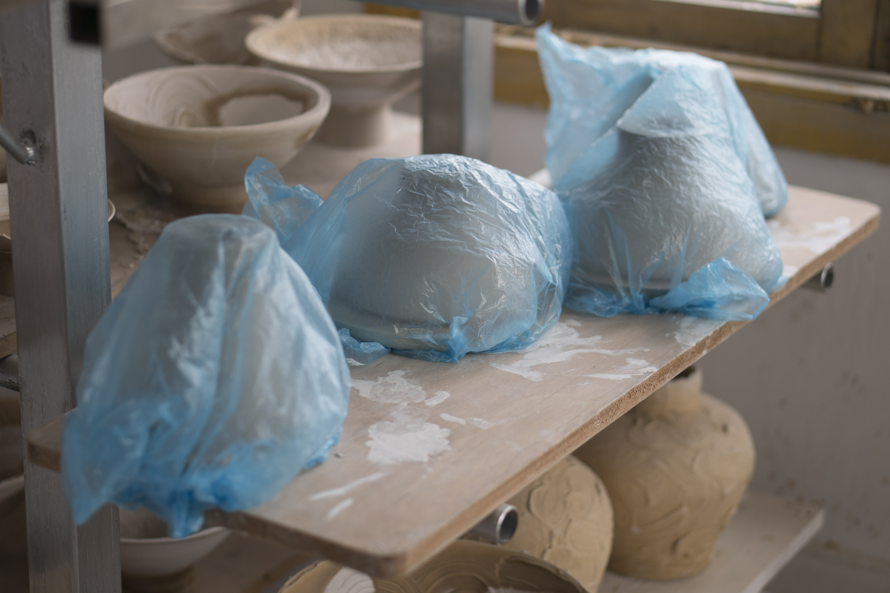
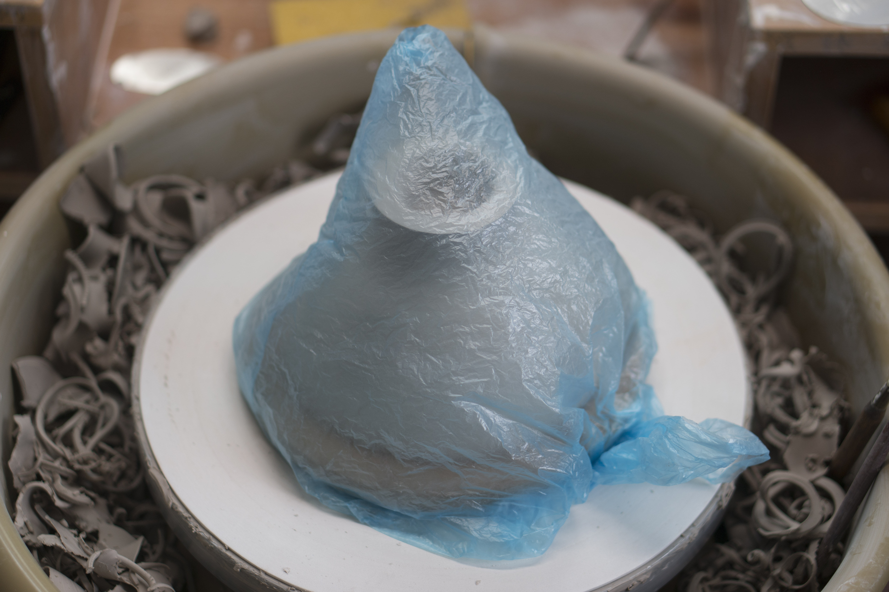
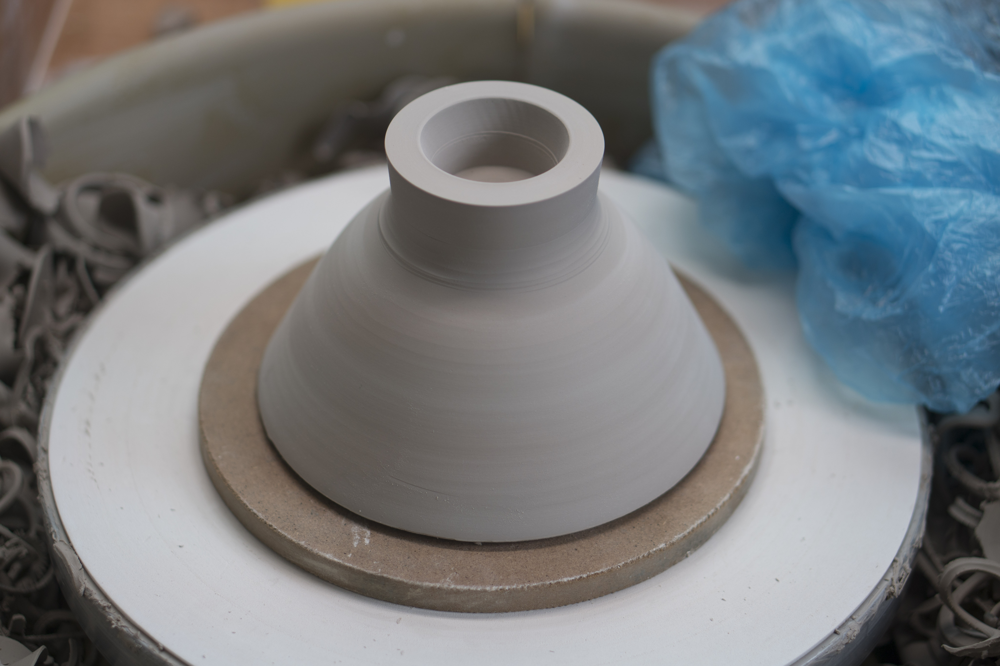
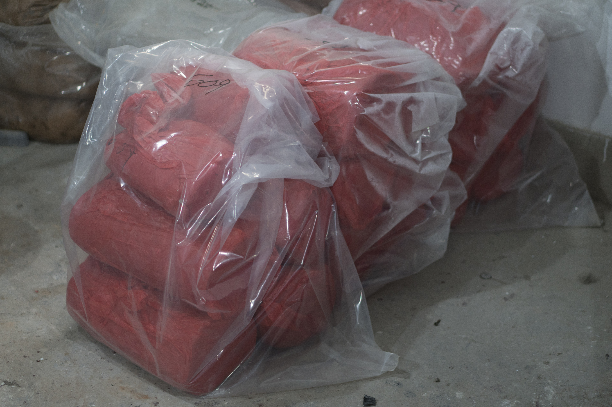

I have a couple "wet boxes".  These are plastic bins with lids into which a layer of plaster has been poured.  The plaster is kept wet in order to maintain humidty, slowing (if not stopping) the drying process.

However, I haven't used the wet boxes in a long time.  I've found it much easier and more convenient to simply wrap each piece in it's own plastic trash bag.  Pieces stored in this manner can be trimmed weeks or even months later.

Ware placed on MDF bats and wrapped in plastic trash bags.  

Ware is placed mouth-down on an MDF board to prevent warping. The boards mold easily, alternatively only wrap the ware.

After two months the ware is still wet, although the moisture is now distributed more uniformly.

Bags of clay are double-bagged in large heavy-duty plastic bags. A piece of soaked plaster is placed in the bottom of the bag.
