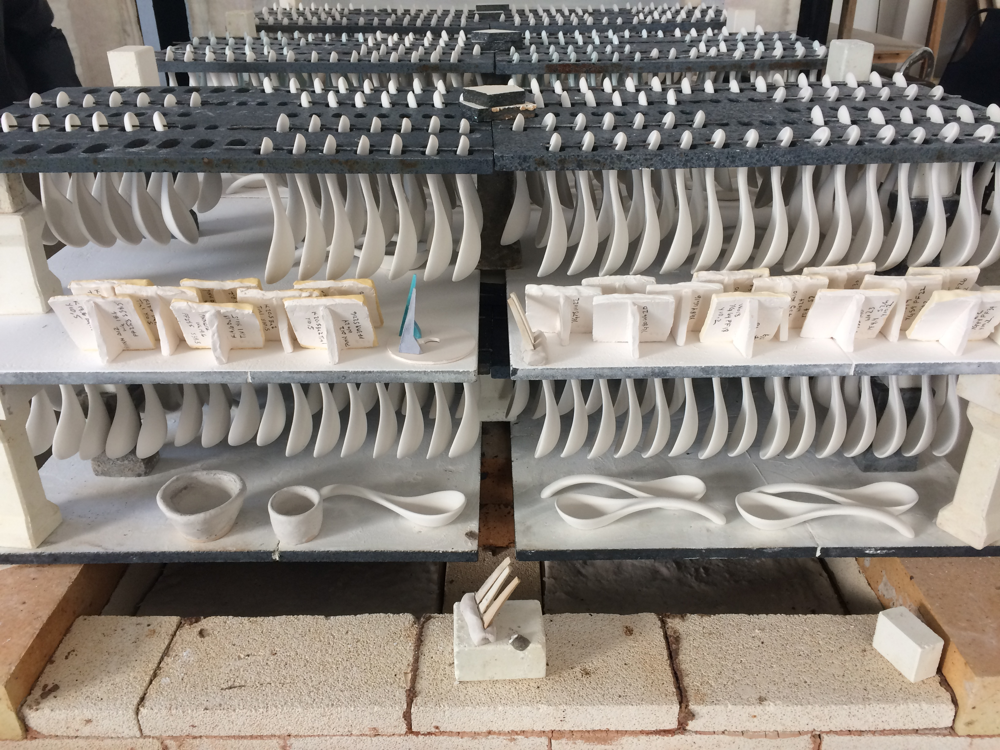
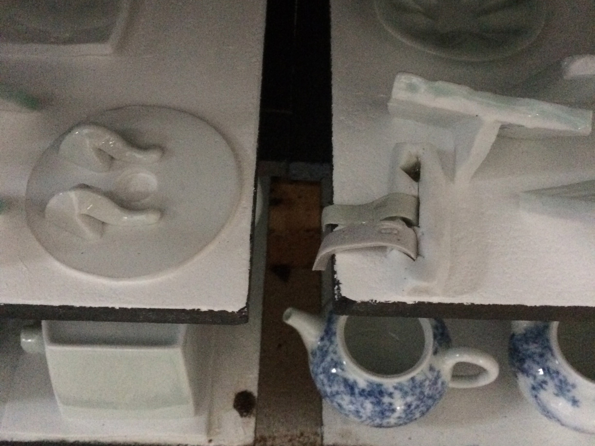

Well, that didn't work out. The kiln master ended up over-firing, past Chinese cone 10. Orton cone 12 probably dropped around Chinese cone 8/9. Looking forward to doing a better test in my own kiln.
