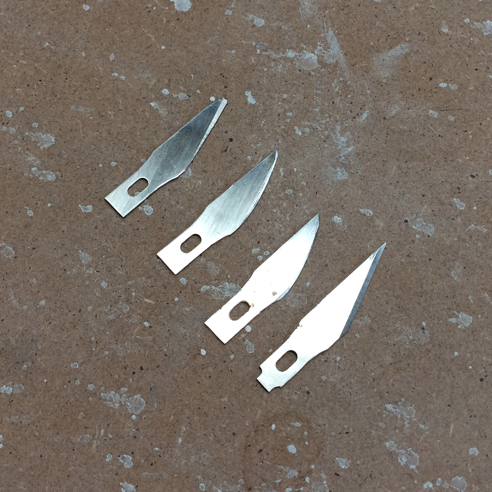
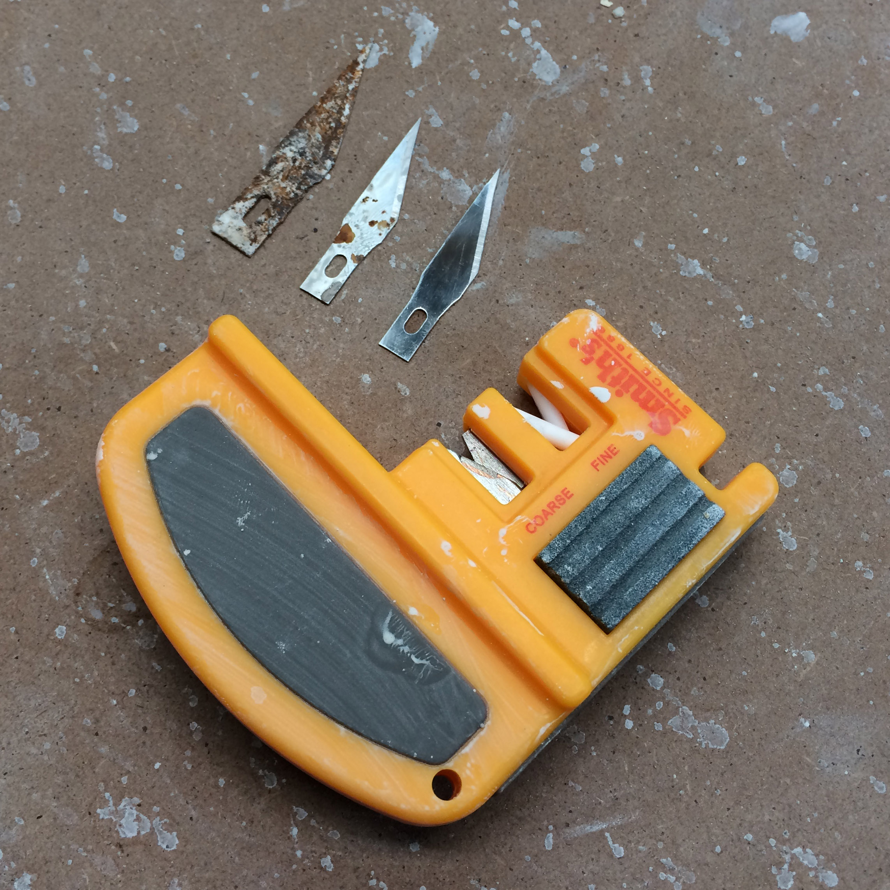
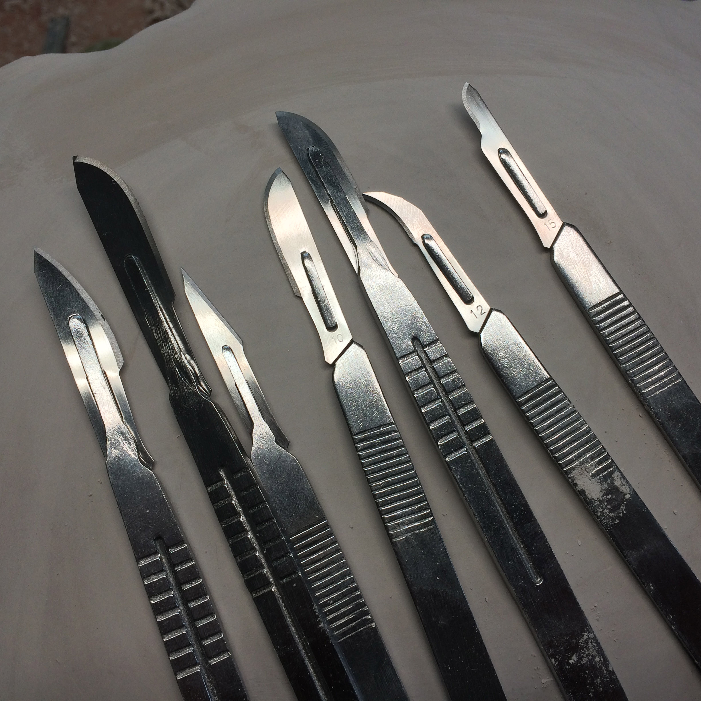

I use X-acto blades all the time, some modified for specific tasks like carving porcelain or scraping glaze off of feet.

I'm not sure if it's all part of a vast X-acto conspiracy, but it seems that a lot of people don't know that these blades can be easily & quickly sharpened?  While there are a number of sharpening methods (even just using bare fired porcelain) that will work, it can be tedious to get the sharpening angle right.  The most convenient method I have found is an angled sharpener (pictured).  Just a few quick passes through the ceramic sharpener gets the blades useable again.  It's faster for me to sharpen the blade than switch out a dull blade for a new one.  (Unfortunately my sharpener is approximately 45% degree sharpening angle (> 20 degrees per side), it might be better to have a narrower-angled sharpener.)

Also note that not all X-acto blades are stainless steel.  You don't want rusty blades all over your studio or in your reclaim.  A 10 or 100-pack of stainless steel #11 blades might last you a lifetime.

An alternative to X-acto blades are stainless steel surgical blades. They come in a wide variety of shapes and sixes perfect for a number of jobs. I usually use the blades without a handle. They come in ten-packs and last a really long time if you sharpen them.

