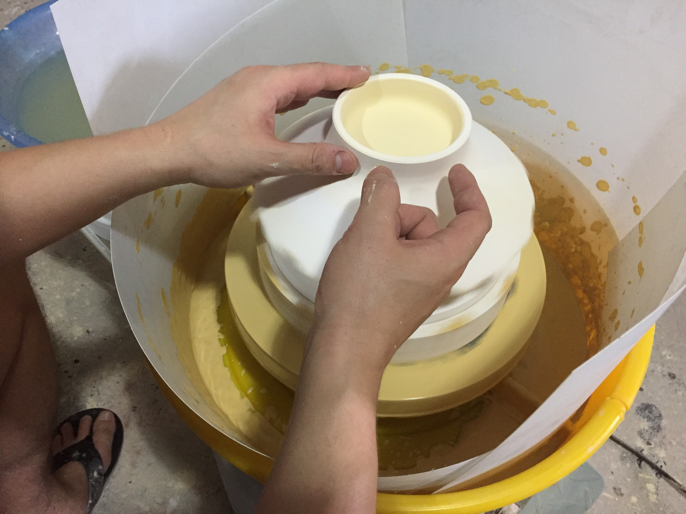
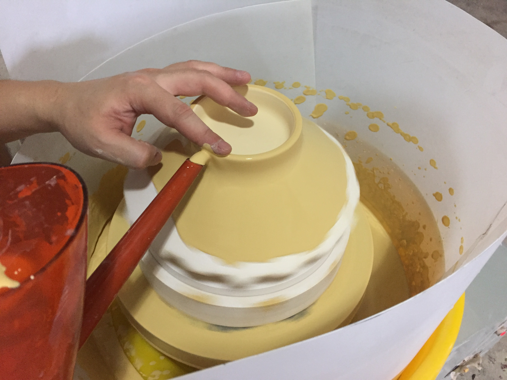
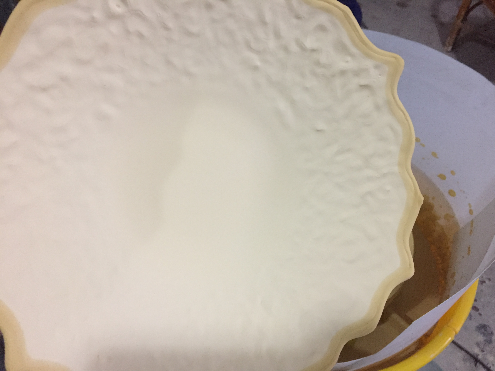

I'm sure that using a garden watering can for pouring glazes is a common technique, but when I came up with the idea I thought I was a genius :) The design of a watering can ensures a constant, strong stream of liquid during pouring that is perfect for glazing. Bubbles are reduced since the watering can pours liquid from the bottom of the can.

Adjust the specific gravity of the glaze. Here, a 250ml beaker is zeroed-out.

The weight of 250ml glaze is 386.7. Dividing by the weight of water, 386.7/250 = 1.55. For this glaze, 1.5-1.6 is a good pouring thickness.

Filling a watering can with glaze.

Rotating the piece with your hand, maintain a continuous pour of glaze.

You might need to rotate the piece backwards and forwards two or three times.

Using a brush with watered-down glaze, fill in any holes

Glaze must be sufficiently watery in order to be absorbed into the hole.

Glaze will inevitably end up on the outside of the piece. First scrape with a blade or metal rib.

Finally, sponge off any glaze that remains on the outside.

### Pouring the Outside

Once the inside is glazed, I will wait until the next day to glaze the outsides.  It's important not to overload the bisque ware with water.

I use an old electric wheel for pouring the outsides.  It's important to rotate the wheel at sufficient speed so that glaze does not gather on the inside rim of the pot.

[Here's a good video by John Britt about pouring the outsides on a turntable.](https://www.youtube.com/watch?v=3Gt3Ys_r3-I)

Plastic strips are inserted into the splash pan to prevent glaze from spraying outwards. A heavy plaster model is tap-centered on the wheel.

A soft piece of sponge is placed on top of the plaster to protect the inner glaze surface.

A bowl is placed on top of the plaster model and tap-centered.

The watering can is used to pour glaze starting from the foot. My finger stabilizes and prevents glaze from running into the foot.

The application properties of your glaze will determine the amount of time the glaze should be poured. For this celadon glaze with an SG of 1.48 I pour from 4-5 seconds. Keep the wheel turning after glazing to ensure excess glaze is forced from the rim.

Once the glaze has lost its glossy sheen, scrape off glaze from the bottom of the foot with a rib.

Using a wet, clean sponge, clean off remaining glaze from foot.

With sufficient wheel speed, the glaze should not gather too much on the inside of the pot. Once dry, excess rim glaze can be scraped off.

## December 2019 Update

Not having anyone in the studio to help me pour big pieces, I came up with a very simple solution:

https://vimeo.com/381476679
