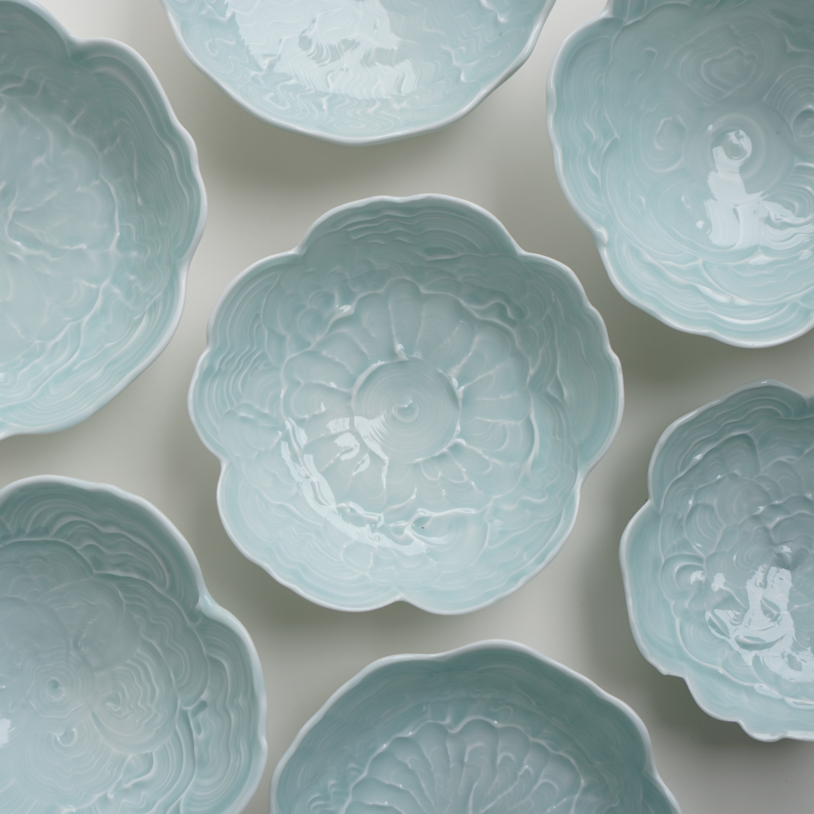
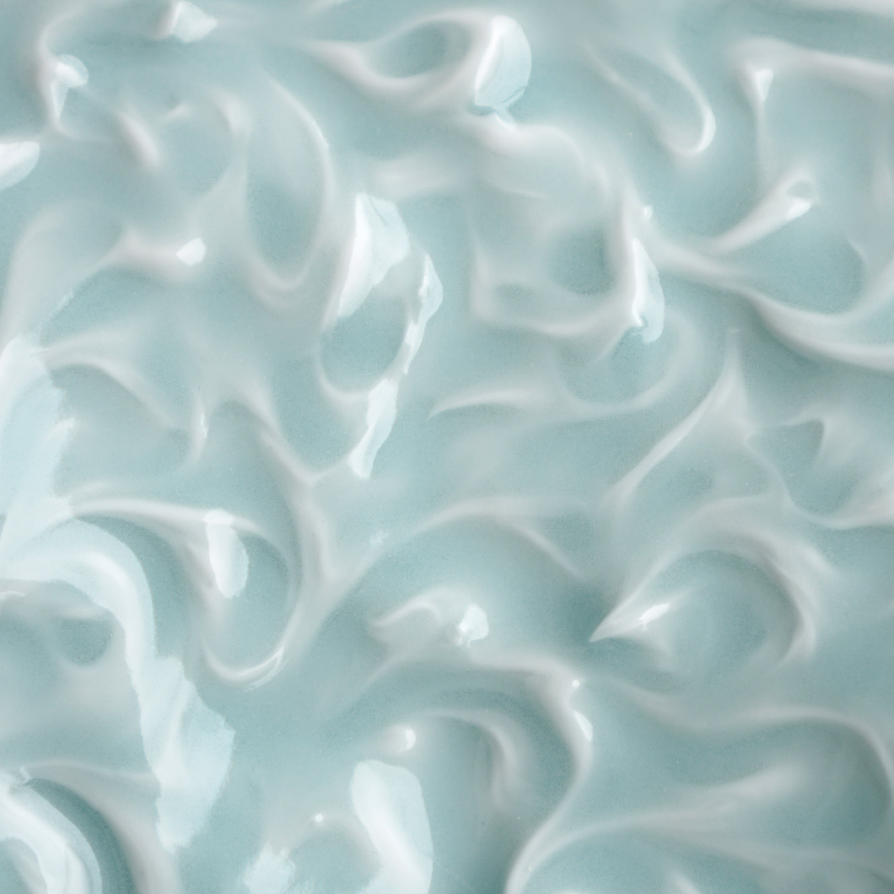

Recent firing with traditional porcelain stone glaze. In the past I've tried but failed to use modern materials like feldspar and kaolin to capture the beautiful, unctuous surface and depth of porcelain stone celadons. In this glaze the coloration is completely due to iron occurring naturally in the material.

