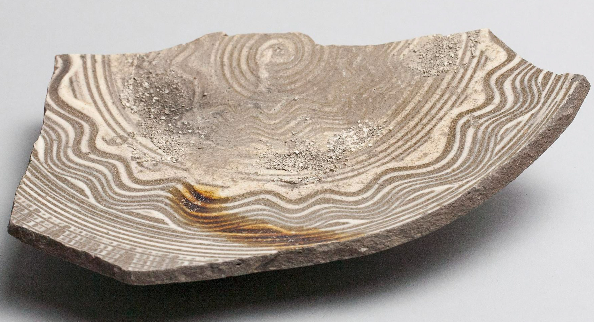

With 10,000 years of history, there's really never anything new in ceramics, just reinterpretations of the past.  [Bowl base fragment](http://www.asia.si.edu/collections/edan/object.php?q=fsg_FSC-P-2056), Edo period, Takeo Karatsu type.  Freer & Sackler Galleries.

