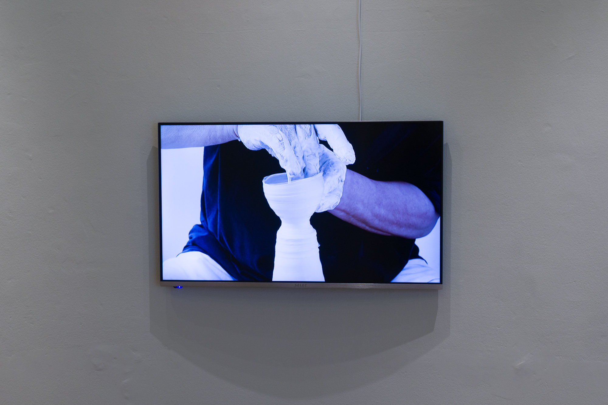

"From, In, to Jingdezhen; Eight Experiences", an exhibition organized by Jae Won Lee, brought together a mix of artists who make work in Jingdezhen.

For this exhibition I refined the porcelain slipware that I began last year, exploring new designs with brushed slip.  I also began a documentary project, [72 Hands (72hands.org)](http://72hands.org/), in which I am recording traditional craft techniques in high-definition video.

[Gimhae Clayarch Museum Exhibition Page](https://www.clayarch.org/web/board/BD_board.view.do?seq=MjAxNzA3MTMxMDA2MzAzMTA%3D&bbsCd=1080&pageType=&showSummaryYn=N&delDesc=&q_currPage=1&q_sortName=&q_sortOrder=&q_ctgCd=&q_searchKeyType=&q_searchKey=&q_searchDt=103&q_searchVal=&tab=)

2017 클레이아크김해미술관 하반기 기획전  
**경덕진; 백자에 탐닉하다****From, In, to Jingdezhen; Eight Experiences**

〇 **기       간** : 2017. 09. 09. (토) ~ 2018. 02. 11. (일)

〇 **장       소** : 돔하우스 중앙홀, 1, 2 갤러리

〇 **전시규모** : 도자 기(器), 도판, 설치작품 약 200여점

〇 **큐레이터 **: 이재원(미국 미시건주립대 교수)

〇 **참여작가** : 이승희(Lee Seunghee/韓), 진젠화(Jin Zhenhua/中), 장밍(Zhang Ming/中), 왕지안(Wang Jian/中), 펠리시티 아리프(Felicity Aylieff/英), 타케시 야스다(Takeshi Yasuda/日, 英), 데렉 오(Derek Au/美, 中), 토마스 슈미트(Thomas Schmidt/美)+제프리 밀러(Jeffrey Miller/美), **총 9명(7명+2인 1팀)**

〇 **부대행사** : 전시개막행사(9. 8), 강연(10. 11)

〇 **주최/주관** : 김해시 / 클레이아크김해미술관

**다양한 도자경험의 산실, 경덕진(景德鎭, Jingdezhen)**  
   2017 클레이아크김해미술관 하반기 기획전『경덕진; 백자를 탐닉하다』는 아홉 명의 예술가(일곱 명의 도예가와 두 명의 협력자)가 제시하는 백자에 대한 여덟 가지 유형의 시각을 조명한다. 이들은 우연히 혹은 운명적으로 중국 전통도자의 수도인 경덕진을 접했으며 이곳을 자신들의 창조 작업과 활동의 본거지로 삼았다. 이곳 토박이인 왕 지안을 제외하면 이 전시에 참가하고 있는 도예가들은 도자 연구를 목적으로 경덕진을 처음 방문한 후 자주 이곳을 찾았거나, 여러 차례 장기간 체류하거나, 혹은 심지어 이주해 이곳을 자신들의 생활터로 삼은 경우도 있다.

   19세기의 도자제작기법이 여전히 통용되고 있는 경덕진의 환경 속에서 이들 도예가들은 자신들의 다양한 배경, 예술적 목표, 습성, 문화, 언어, 철학, 전통에 기반해 새로운 것을 모색하고 발견하고자 했다. 도자제작의 중심지에서 일어나고 있는 정신과 물질의 상호관계와 변화는 독특한 도자작업, 다양성의 문제, 공동체라는 개념 그리고 역동적인 변화로 방문자들의 눈길을 붙잡았다.

   이번 전시에서는 기(器, vessels)의 개념을 다양하게 보여주는 작품을 선보인다. 각각의 작품은 그릇의 개념을 직접적으로 다루고 있거나 간접적으로 이러한 주제를 구현하고 있다.  경덕진과 관련된 이러한 여덟 가지 유형의 패러다임을 통해 도예가들은 인간마음의 메레올로지(mereology, 부분과 전체 사이의 관계를 연구하는 학문)를 표현한다. 경덕진의 도자를 자신만의 독특하고 혁신적이며 비범한 결과물로 변화시킨 이들의 창조적인 작업과 삶에 경의를 표한다. 이들이 보여주는 여덟 가지 유형의 경험은 단순성, 문화적 표상, 혼합, 그리고 연금술적인 큰 뜻과 예술적 이상을 종합적으로 보여준다.
