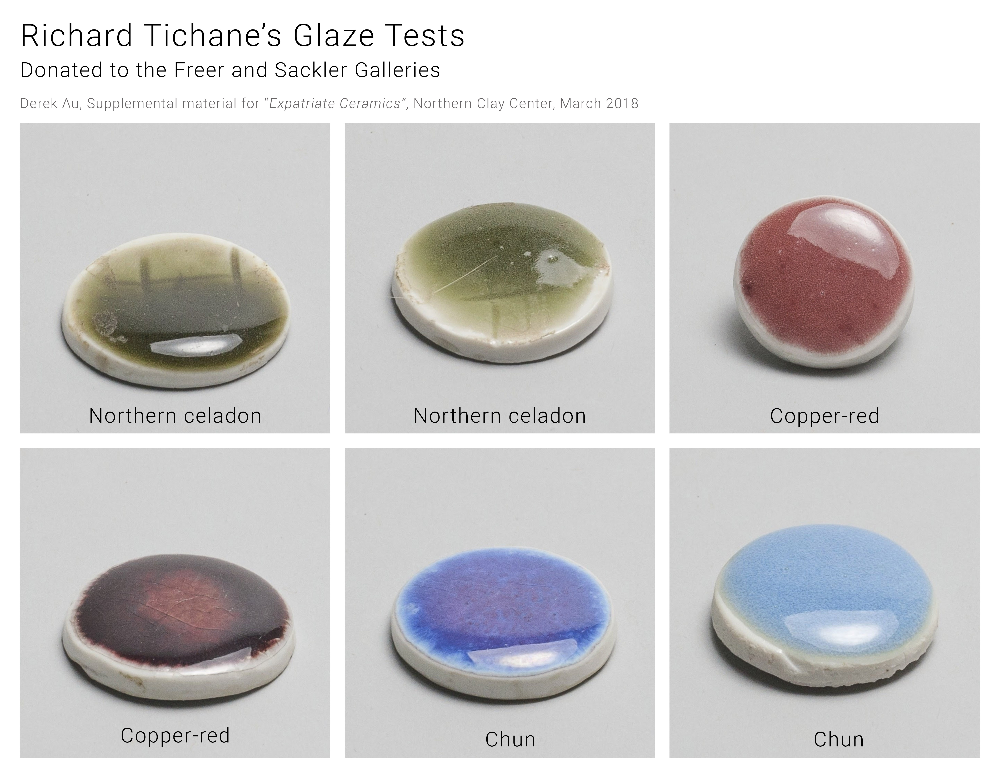
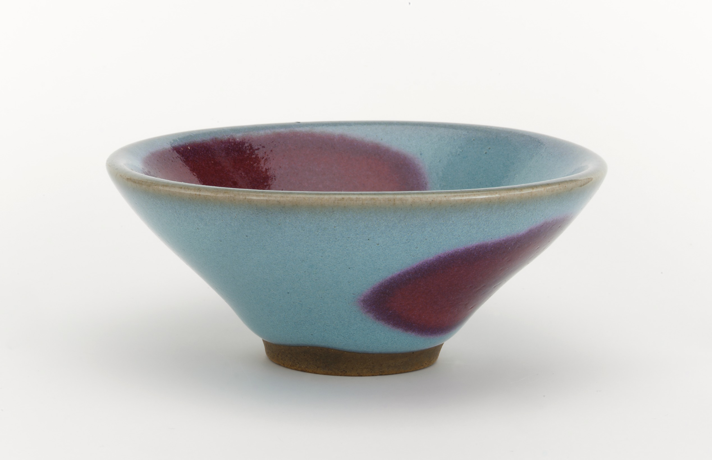
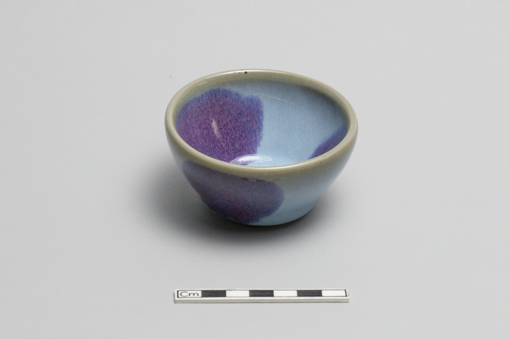
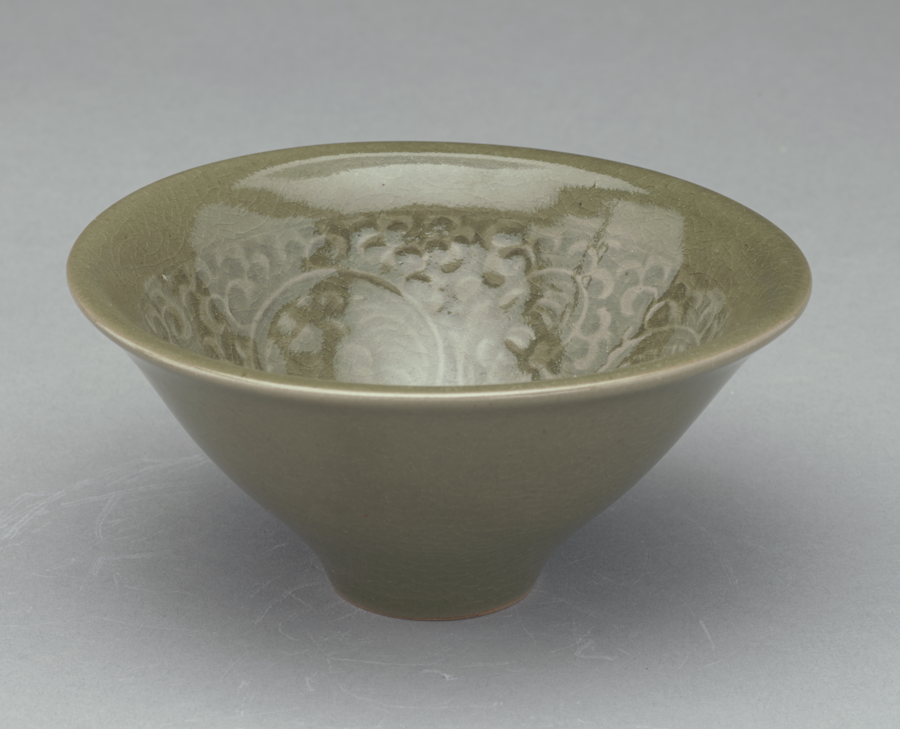

Some of [Robert Tichane's](http://(https://www.amazon.com/Robert-Tichane/e/B001KMNGXA/) glaze tests and reproductions of Chinese Glazes donated to the Freer and Sackler Galleries: [https://archive.asia.si.edu/collections/edan/default.cfm?searchTerm=tichane&btnG.x=0&btnG.y=0&btnG=Search](https://archive.asia.si.edu/collections/edan/default.cfm?searchTerm=tichane&btnG.x=0&btnG.y=0&btnG=Search)

Glaze sample: Jun with copper red; Small bowl with two copper-red spots on outside, two on inside

Modern reproduction of Yaozhou ware bowl from original mould in Metropolitan Museum of Art
