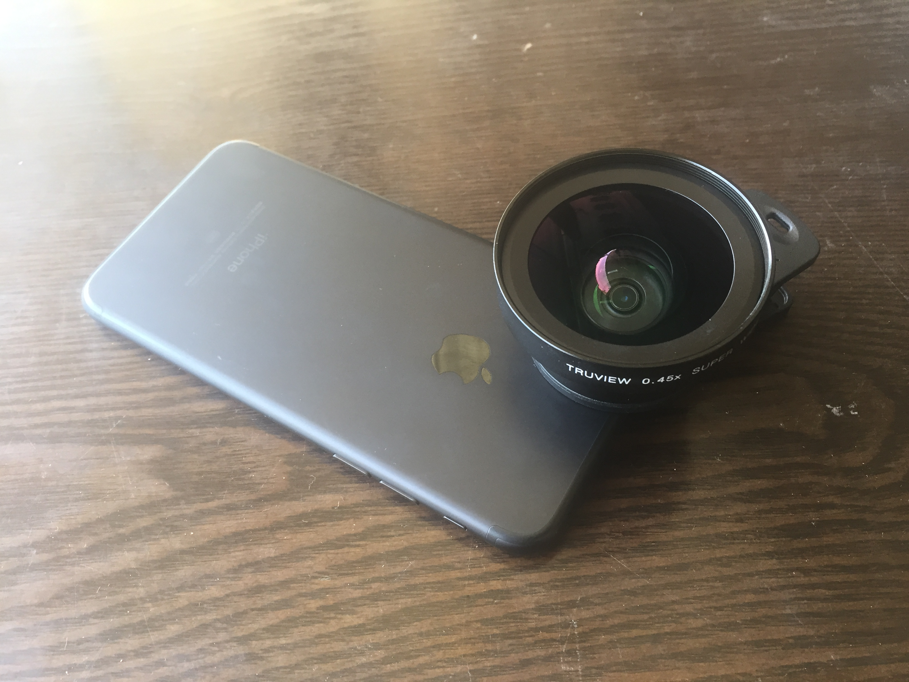
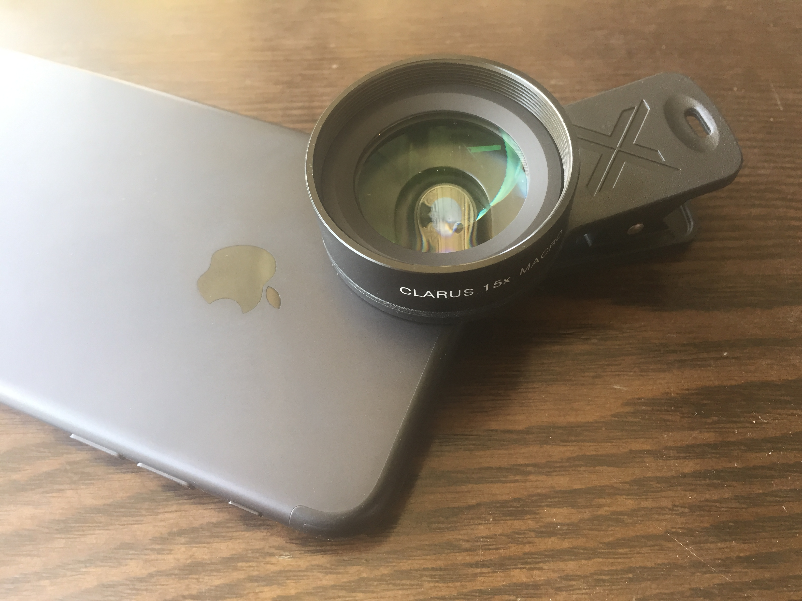
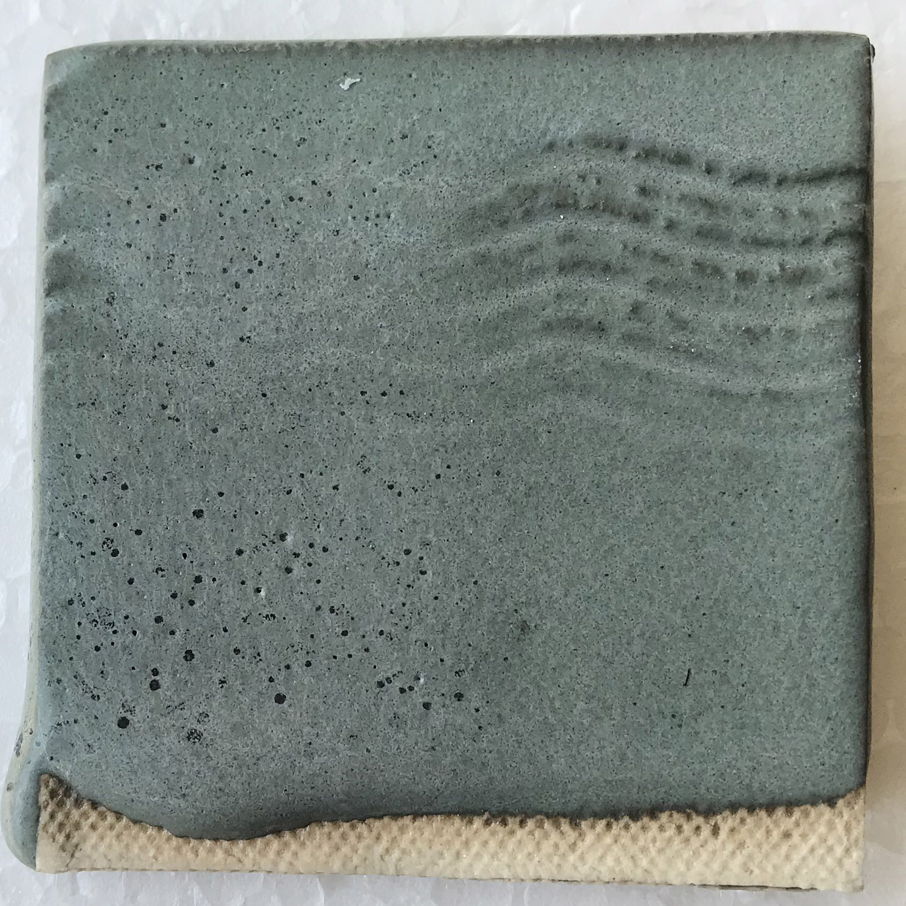
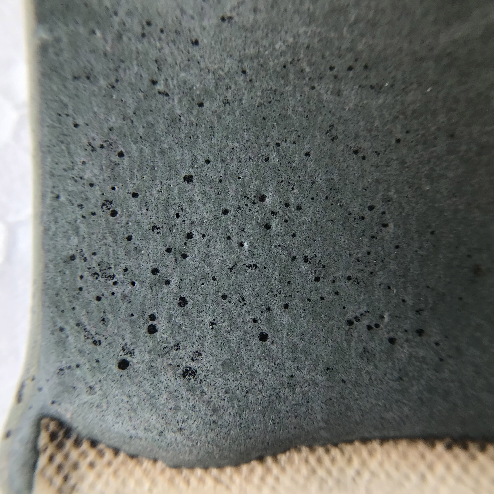
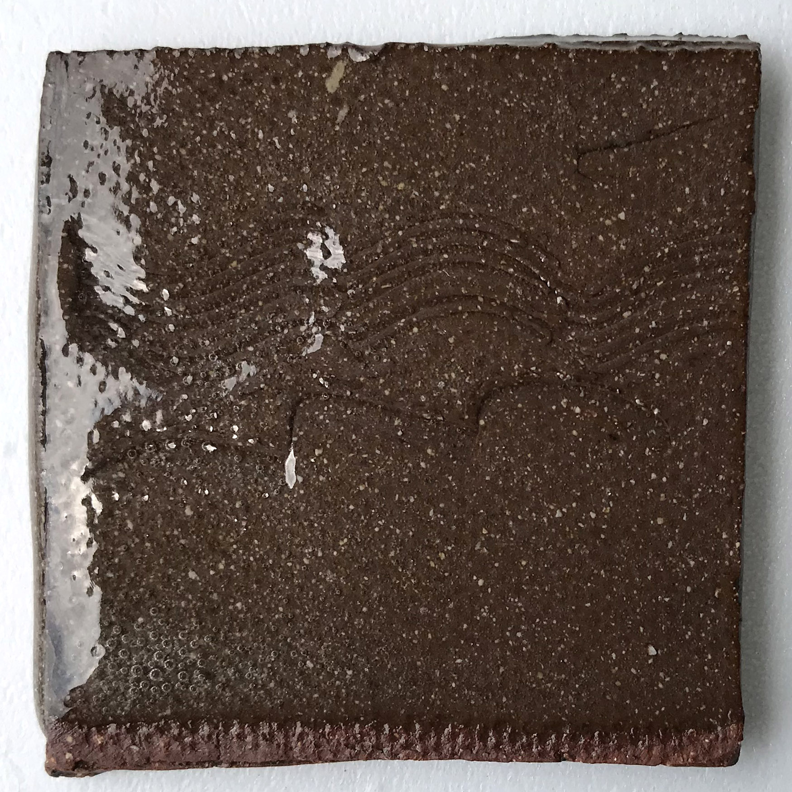
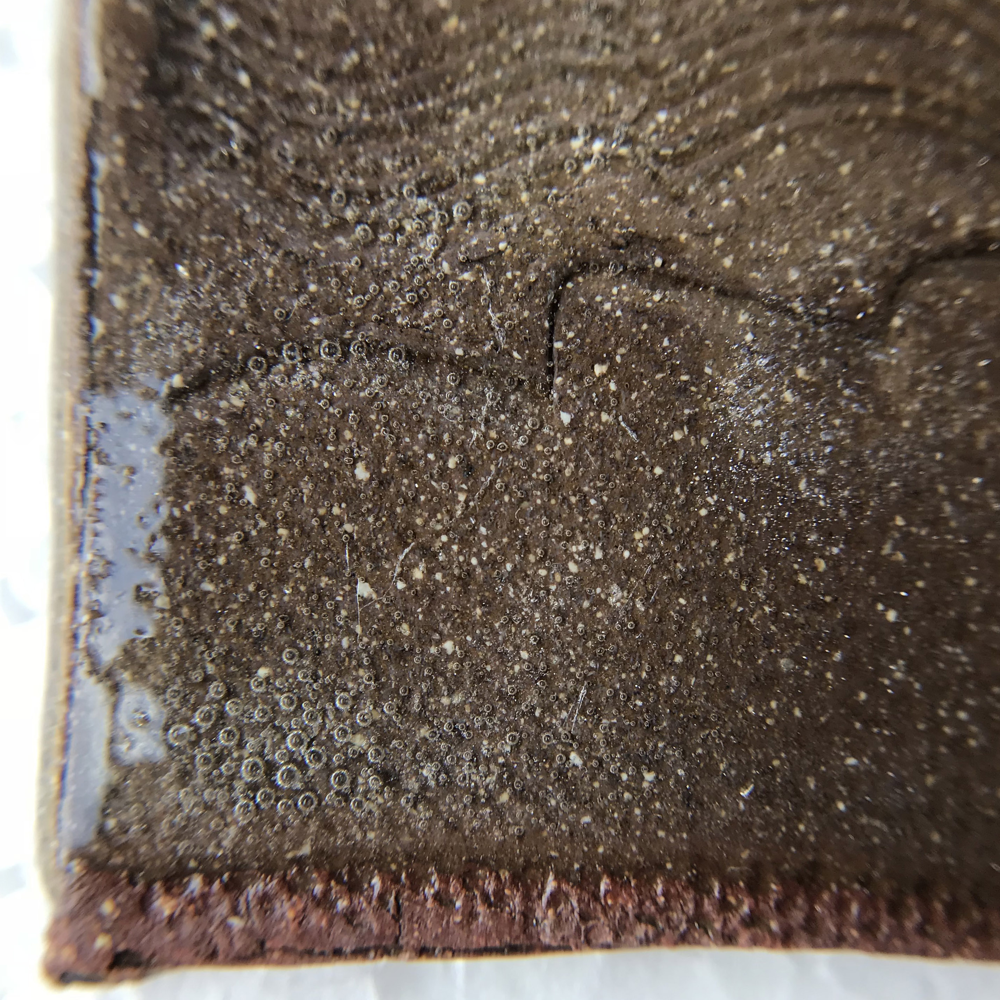
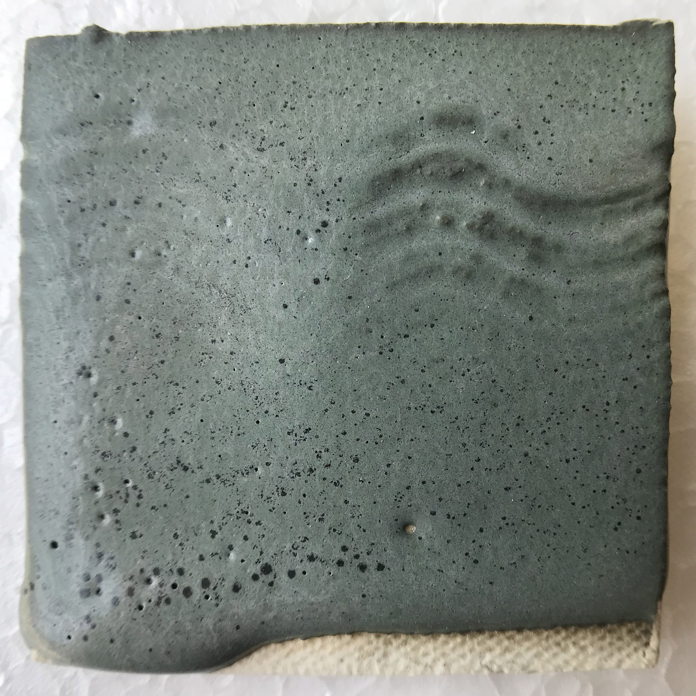
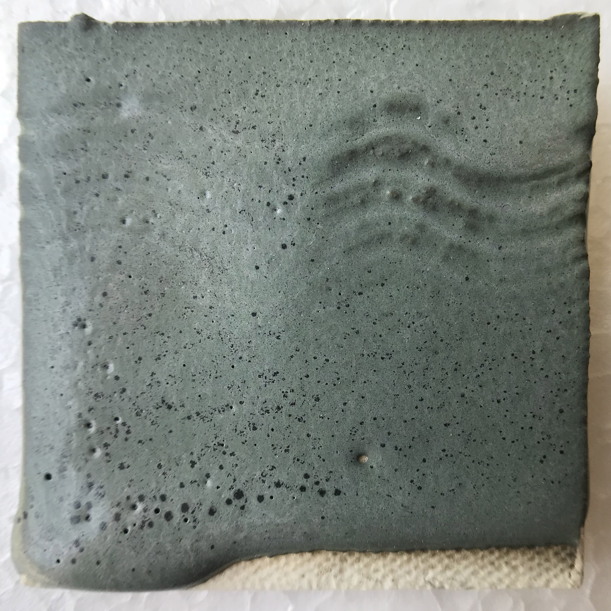

I've tried a number of smartphone lenses in the article [Smartphone Microscopy](http://www.derekau.net/2016/03/27/iphone-microscopy/).

Today I received my first macro lens for smartphones, the [Xenvo iPhone Camera Lens Kit Pro - Macro Lens & Wide Angle Lens with LED Light](https://www.amazon.com/gp/product/B01A6D2JVI/ref=oh_aui_detailpage_o00_s00?ie=UTF8&psc=1).

Macro Lens & Wide Angle Lens attached to iPhone 7

The lens was a bit expensive ($35), but opening the package I was surprised at the weight and feel of quality materials and real glass.  I've only taken a few photos so far but the image quality seems pretty good.

Macro Lens attached to iPhone 7

I'm still not sure how I'll incorporate macro photos of glazes into my documentation.  So far I'm pretty happy with how the macro photos reveal glaze details not visible in normal photos, but still show the character of the glaze (as opposed to microscopic images).

Here are some images of [Katz-Burke Matte with 5% Rutile 5% Mason 6600](https://glazy.org/recipes/20670).

    
    Normal photo taken with iPhone 7.
    

    
    Macro photo taken with iPhone 7 & Xenvo lens.
    

Here are some images of [WCAC Clear Celadon](https://glazy.org/recipes/20547):

    
    Normal photo taken with iPhone 7.
    

    
    Macro photo taken with iPhone 7 & Xenvo lens.
    

Just to test, here is an example from the Xenvo Wide Angle Lens. It's a bit blurry on the edges.

    
    Original photo from wide angle lens.
    

    
    Same photo corrected for lens distortion.
