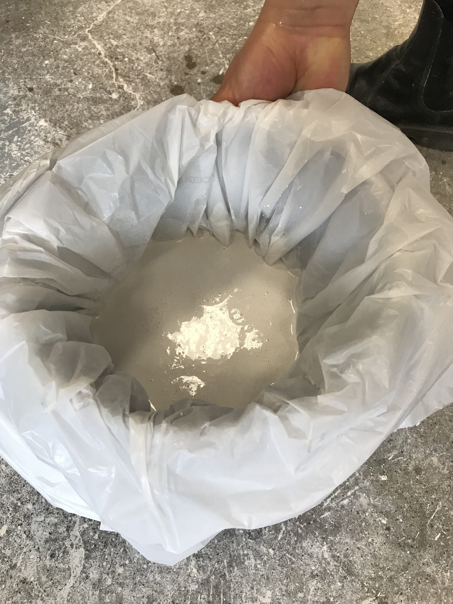
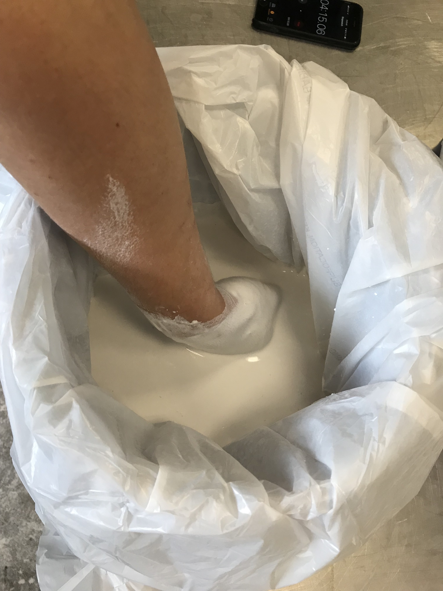
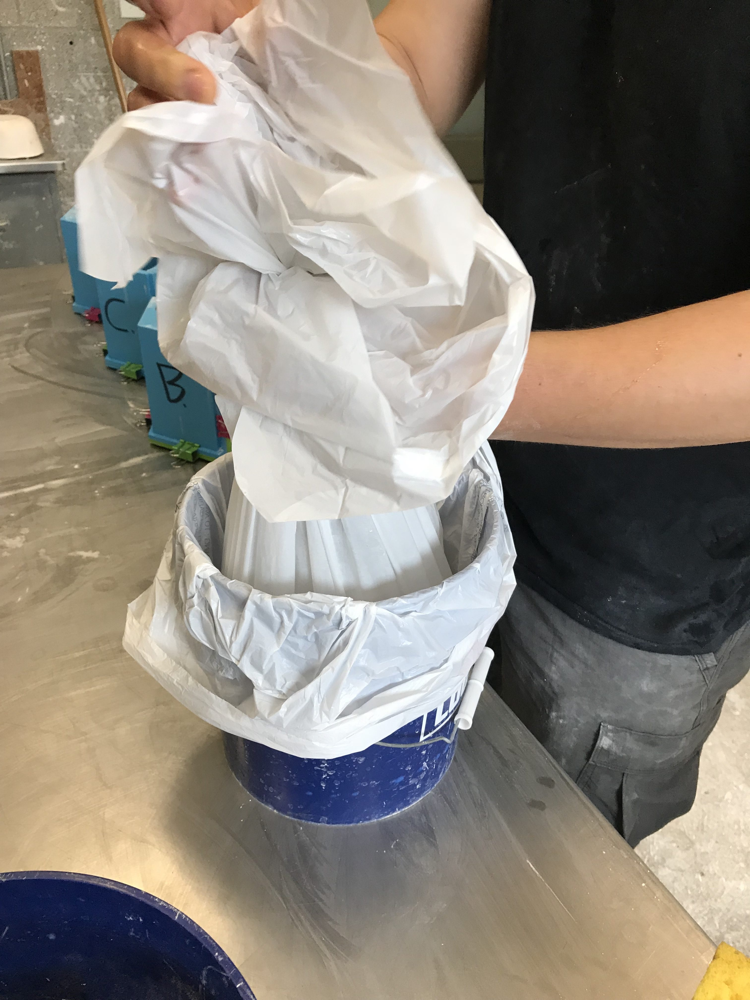
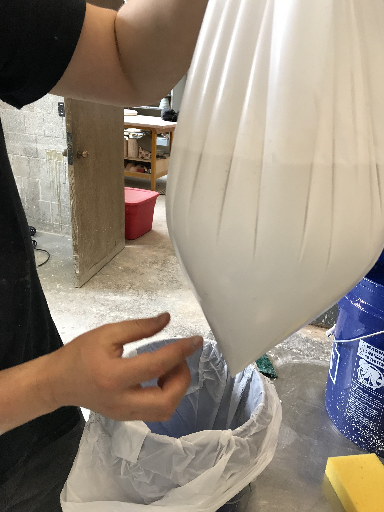
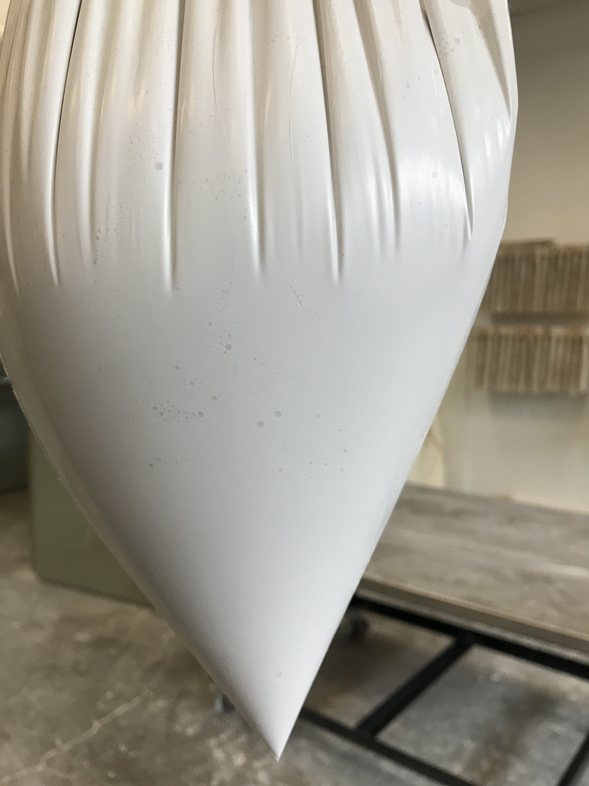
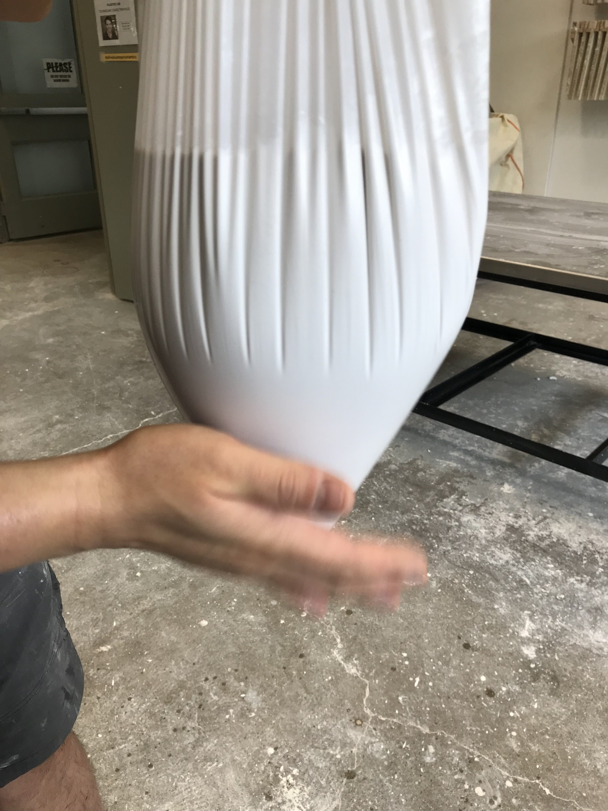
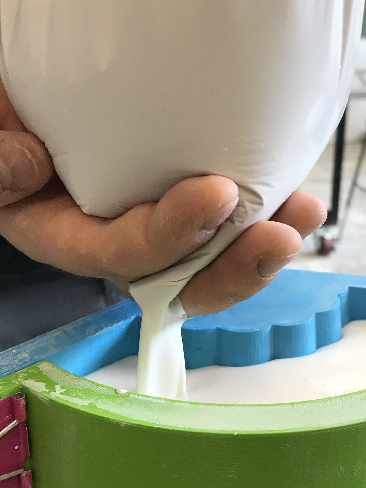

I'm not a plaster master, so I don't know if this is a good or even original idea.  By mixing plaster in a plastic bag, it seems easier to remove bubbles from the mixture, while pouring is much more controlled.  It's the same idea as [using a garden watering can for pouring glaze](http://www.derekau.net/2017/03/12/pouring-glaze-with-a-watering-can/):  You pour from the bottom where pressure is highest and bubbles are fewest.

    
    Add measured amount of water, then plaster into plastic bag supported by bucket.
    

    
    Let sit for a minute or two, then stir as usual, being careful not to entrail air into the mixture.
    

    
    Lift the bag out of the bucket, checking for leaks.
    

    
    Check for air bubbles in the mixture.
    

    
    Air bubbles trapped in the plaster mixture.
    

    
    Pat the plastic bag, vibrating the air bubbles to the top.
    

    
    Cut a small corner off the bag, and control release of plaster using fingers. Pour in a controlled fashion against a wall without splashing.
