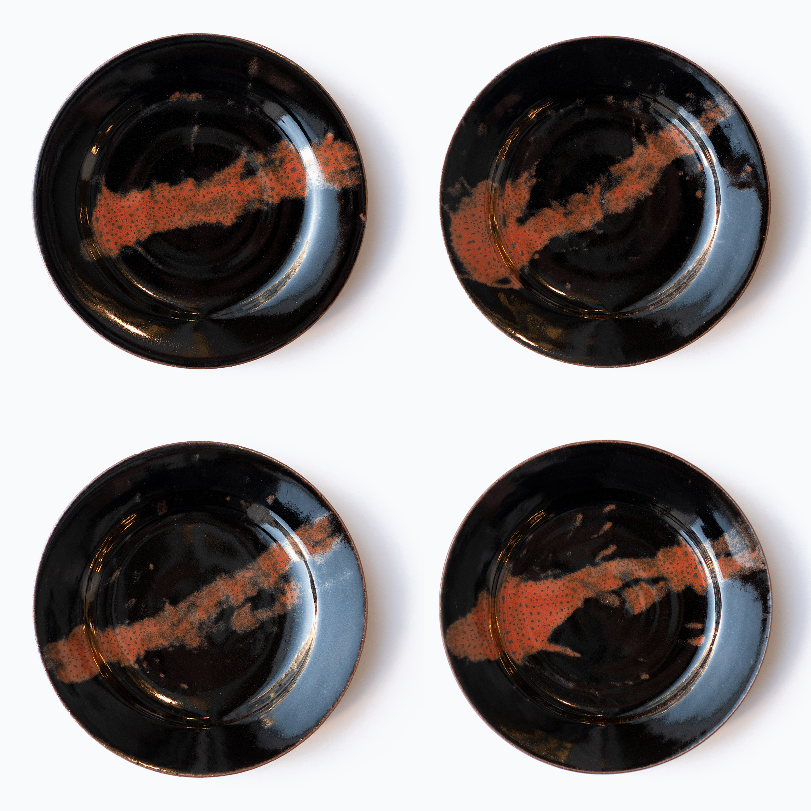

Sometimes you just want to make some plates. And not think about Art or the History of Ceramics. Just plates.

These plates use a variation of the Iron-Saturate glaze I developed earlier.  See previous posts or visit my article here:

http://www.derekau.net/2018/09/22/iron-saturate-glazes/

This glaze is Kaki Biaxial D4 (8% Bone Ash, 13% RIO)  
[https://glazy.org/recipes/25001](https://glazy.org/recipes/25001)

