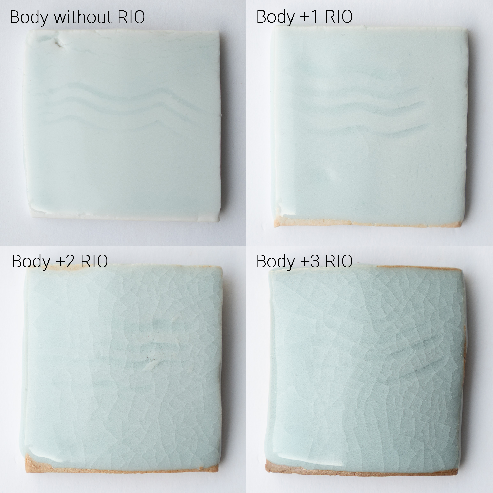

Here's another test with fixed glaze and variable body.  The glaze is [@pete.pinnell](https://www.instagram.com/pete.pinnell/) Pinnell Blue Celadon (a fairly low-expansion glaze that does not usually craze on porcelain bodies), while the porcelain is a typical high-fire body with Red Iron Oxide (RIO) successively added in 1% increments. Fired in a reducing atmosphere to Orton cone 10.   
Without RIO, this glaze fits the body perfectly.  After adding just 1% RIO to the body we can already see slight crazing, while at +2% RIO the glaze is completely crazed.

https://www.instagram.com/p/BteY7sjA2Wl/
