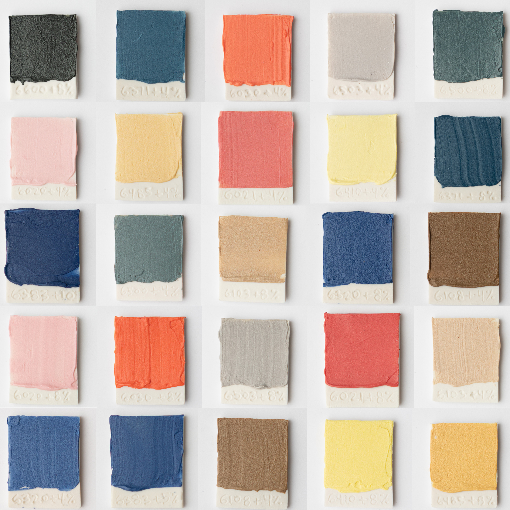

I've added some simple slip recipes to illustrate how one can use the Mason Stains added yesterday.  These slip recipes use a material called "English Porcelain", which is simply an analysis of a typical high-fire porcelain body, as well as 8-10% added Mason Stain.  I hope you will add color tests, too!

You can find these slips in the "Slip & Engobe" section or visit the collection here:  https://glazy.org/u/derekau?collection=7661

https://www.instagram.com/p/BtqlW5rAtTH/
