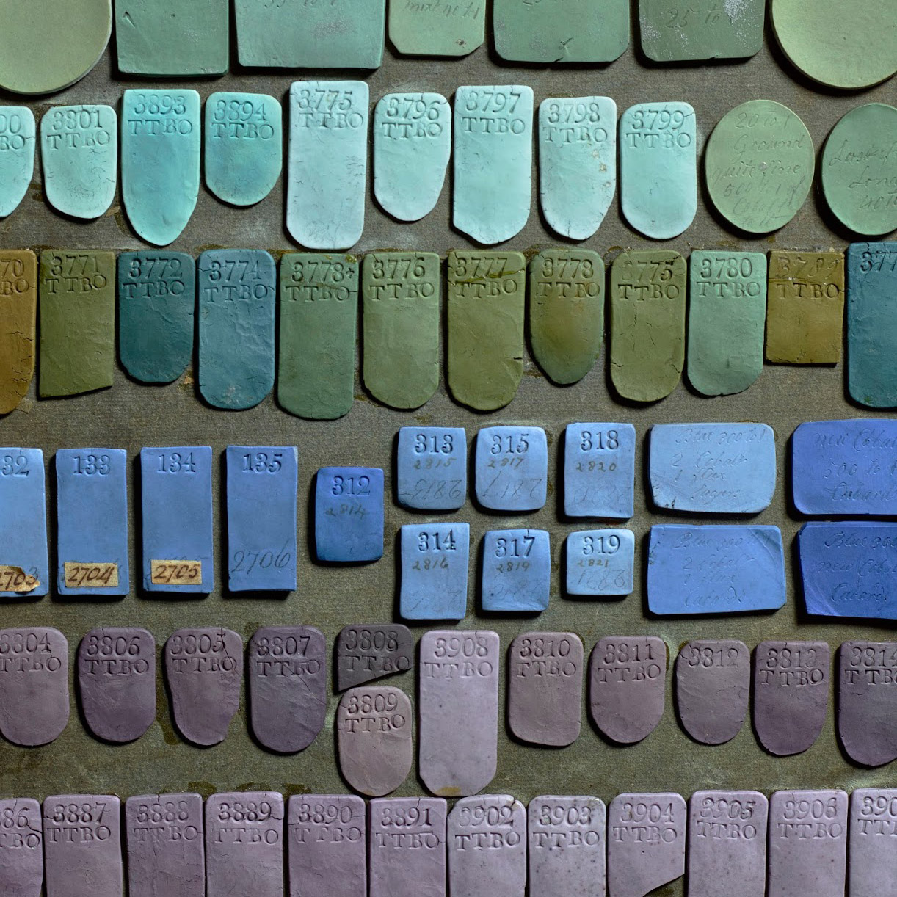
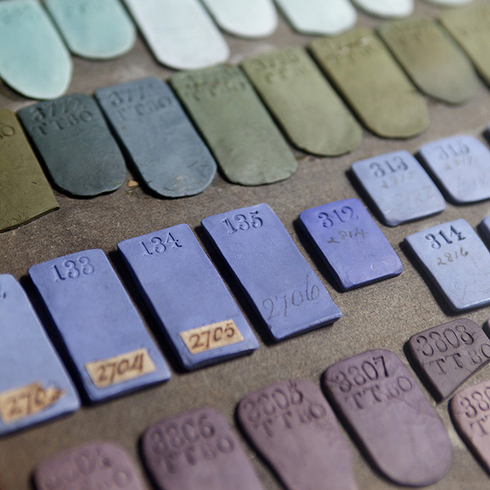

A small portion of approximately 5000 tests created by Josiah Wedgwood for his famous Jasperware. From [http://www.wedgwoodmuseum.org.uk](http://www.wedgwoodmuseum.org.uk)

2nd V&A Wedgwood Collection, Photo by Phil Sayer.  [http://www.vam.ac.uk/content/articles/t/the-wedgwood-collection/](http://www.vam.ac.uk/content/articles/t/the-wedgwood-collection/)

https://www.instagram.com/p/BttDFsfAE9T/
