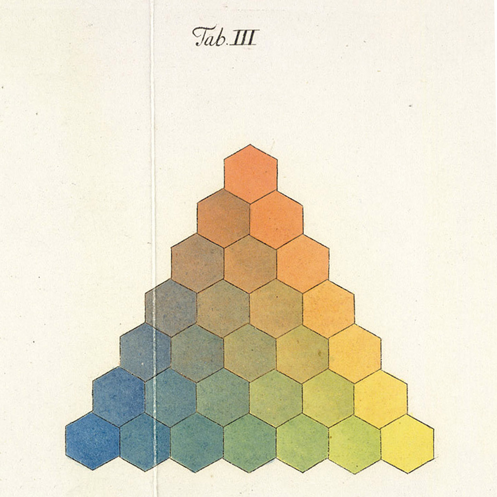
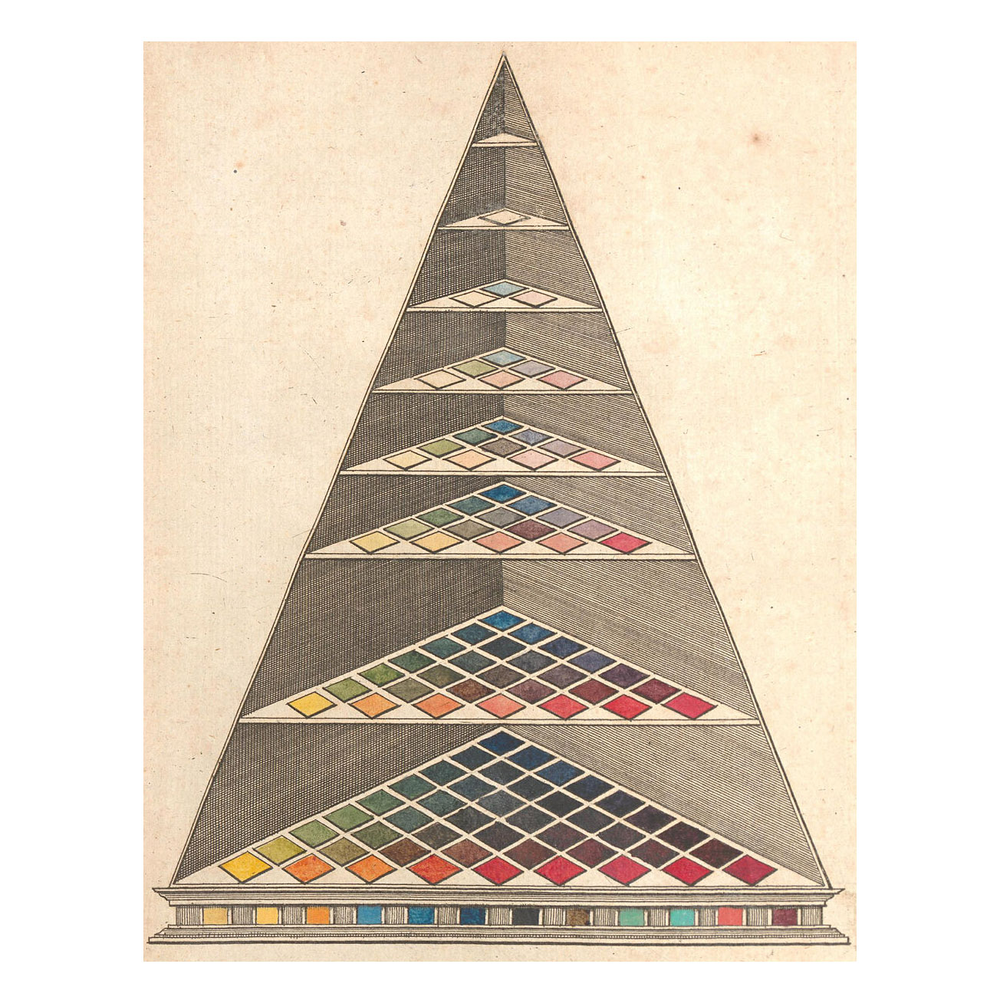

†  
From the fascinating article by The Public Domain Review: "Colour Wheels, Charts, and Tables Through History"   
[https://publicdomainreview.org/collections/colour-wheels-charts-and-tables-through-history/](https://publicdomainreview.org/collections/colour-wheels-charts-and-tables-through-history/)

Georg Christoph Lichtenberg’s representation of the three-sided color graph developed by the astronomer and mapmaker Tobias Mayer.

Johann Heinrich Lambert’s three-dimensional adaptation of Tobias Mayer’s triangle.

https://www.instagram.com/p/BtvrjvyAJqv/
