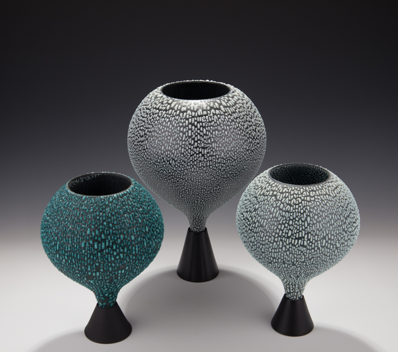
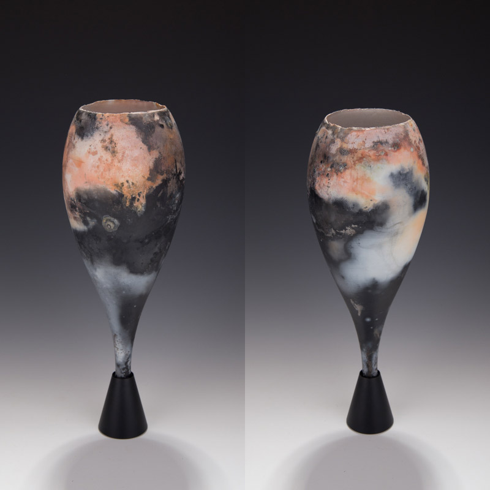
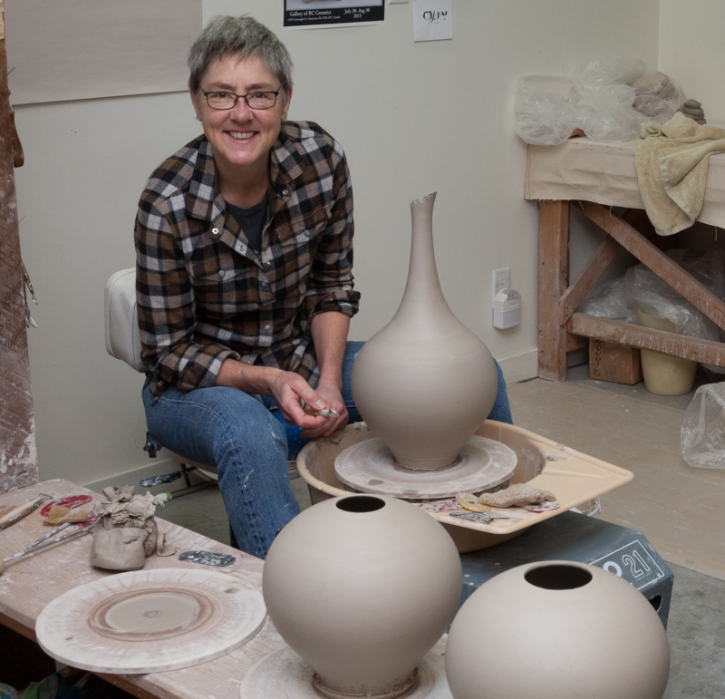
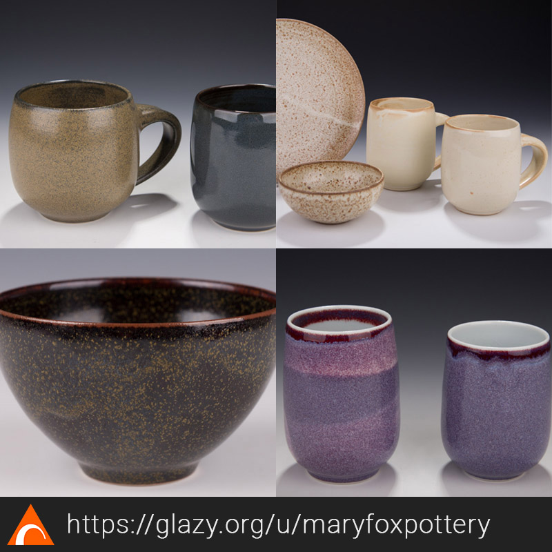

Through Glazy I've met amazing people all over the world, most recently [@maryfoxpottery](https://www.instagram.com/maryfoxpottery/)

It's impossible to even begin to represent this artist through a few images in an IG post.  A self-taught potter who's supported herself through ceramics since 1979, it's astonishing to me how a single person can be so prolific, simultaneously producing multiple lines of work (from beautiful, simple functional ware to large, technically demanding decorative and sculptural forms including her exquisite "chalices") each in a broad range of ceramic bodies, firing temperatures and glazes- and ALSO in glass!  And did I mention she is writing a book?! Mary has been generous with her knowledge through her lectures and workshops, and she's also sharing some of her favorite recipes on Glazy.  Please visit her Glazy home at [https://glazy.org/u/maryfoxpottery](https://glazy.org/u/maryfoxpottery)

    

    

    

    

Please follow [@maryfoxpottery](https://www.instagram.com/maryfoxpottery/) for more beautiful images of her work as well as announcements for upcoming events and her new book!

[#glaze](https://www.instagram.com/explore/tags/glaze/)[#glazes](https://www.instagram.com/explore/tags/glazes/)[#glazerecipes](https://www.instagram.com/explore/tags/glazerecipes/)[#ceramics](https://www.instagram.com/explore/tags/ceramics/)[#pottery](https://www.instagram.com/explore/tags/pottery/)[#ceramicglazes](https://www.instagram.com/explore/tags/ceramicglazes/)[#glazechemistry](https://www.instagram.com/explore/tags/glazechemistry/)[#glazy](https://www.instagram.com/explore/tags/glazy/)
