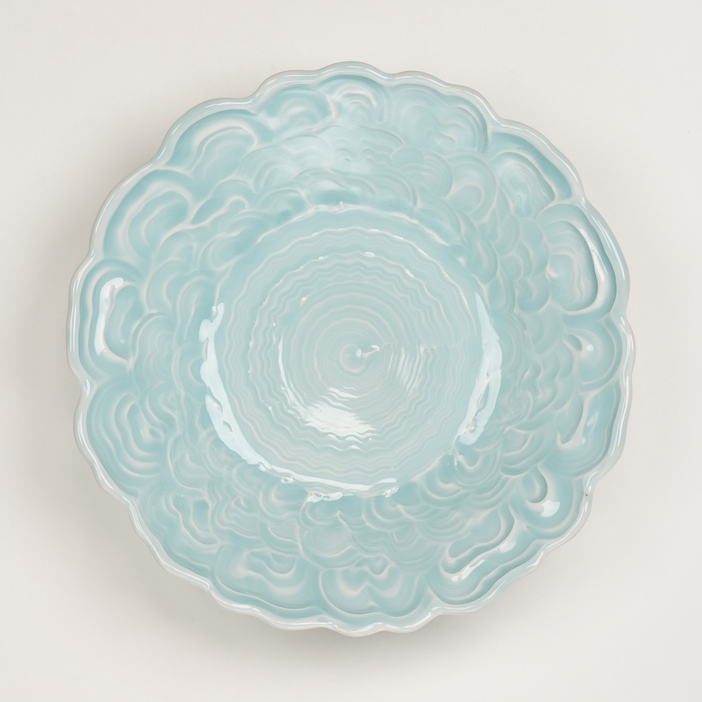
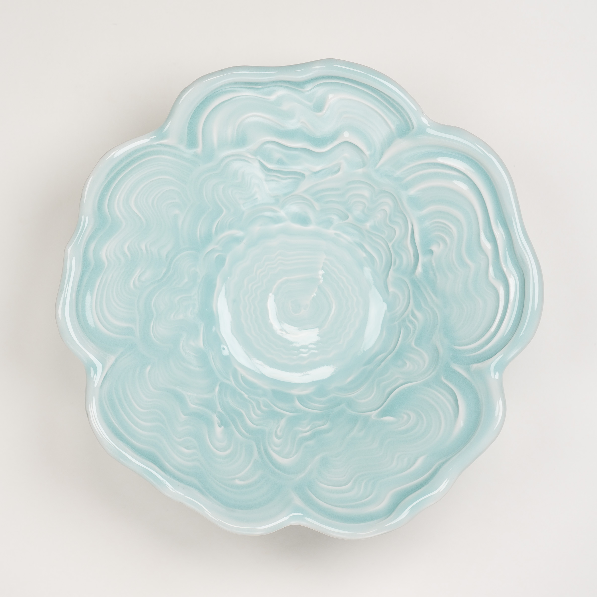

_"Can you leave Jingdezhen?"_

This has been an important question for me during over a decade of study in Jingdezhen, China. In the "Porcelain Capital of the World" it's easy to find anything you could dream of- the whitest, most translucent porcelain clay, glazes of all types and colors, kilns of all shapes and sizes. The city is filled with master artisans who can help you make anything you dream, from 2-meter tall Buddhas to delicate miniature porcelain flowers.

Back in the US I've struggled to find a porcelain clay body and glaze that I was satisfied with, but after hundreds of tests and failed attempts I finally have something that comes close to the quality of what I had become accustomed to in China. It is unfortunate that in order to produce this porcelain body and glaze I have had to include ingredients from all around the world. This is not an “eco” porcelain, even less so as it is fired to high temperatures in an inefficient gas kiln.

Having been involved for a number of years as an activist in the environmental movement, I struggle with the waste and large carbon footprint inherent in the pursuit of our craft. Beauty comes at a price. Just ask the ancient Chinese potters who hollowed out Gaoling mountain for its pure clay and stripped the hills around Jingdezhen of trees to fuel the kilns. While I believe that we all have a personal responsibility to be good stewards of this precious planet, I also believe we must hold dear that which makes us human- our culture and our art. And if our art requires resources, we should allow ourselves to use those resources so long as we feel it is morally acceptable to do so.

[Mahavir Celadon: https://glazy.org/recipes/22821](https://glazy.org/recipes/22821)

[Mahavir Celadon (Calcined NZK): https://glazy.org/recipes/29420](https://glazy.org/recipes/29420)

[Derek’s NZK & Mahavir Porcelain: https://glazy.org/recipes/25288](https://glazy.org/recipes/25288)

    

