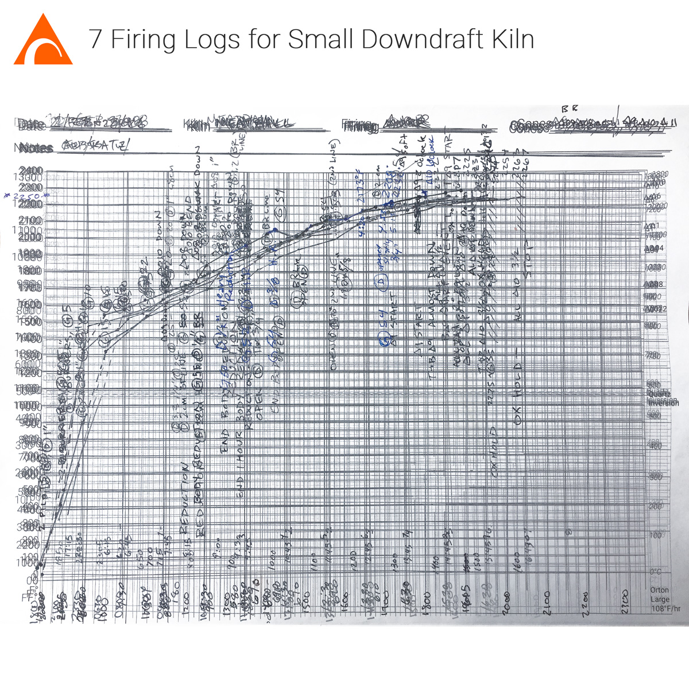
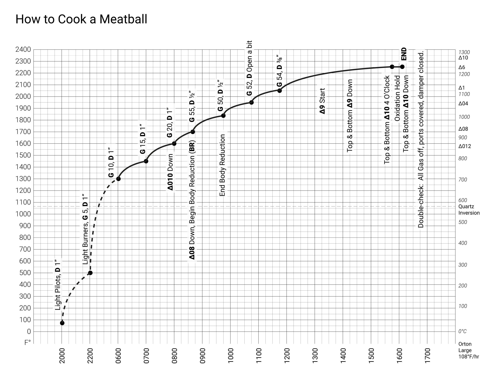

Updated Printable Firing Charts with Fahrenheit & Celsius conversion and markers for common Orton Cones & Quartz Inversion:  
[https://wiki.glazy.org/t/kiln-charts/](https://wiki.glazy.org/t/kiln-charts/)

https://www.instagram.com/p/BuUcT8GA8rX/
