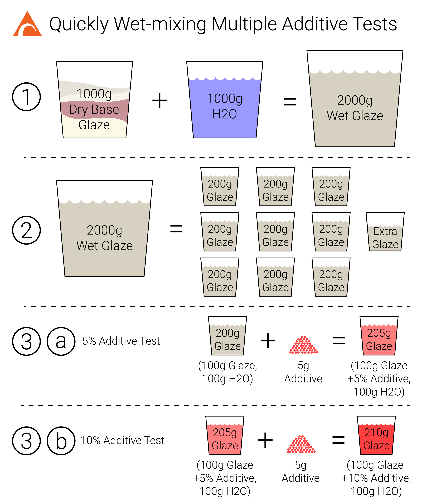

[@ceramicmaterialsworkshop](https://www.instagram.com/ceramicmaterialsworkshop/)'s "Understanding Glazes" course uses the following method to quickly mix variations of a glaze using one batch of base glaze and nine different types of additives (e.g. cobalt, copper, iron, stains) in two different amounts each.  It's a really simple way to learn how different additives like colorants and opacifiers affect a glaze.

