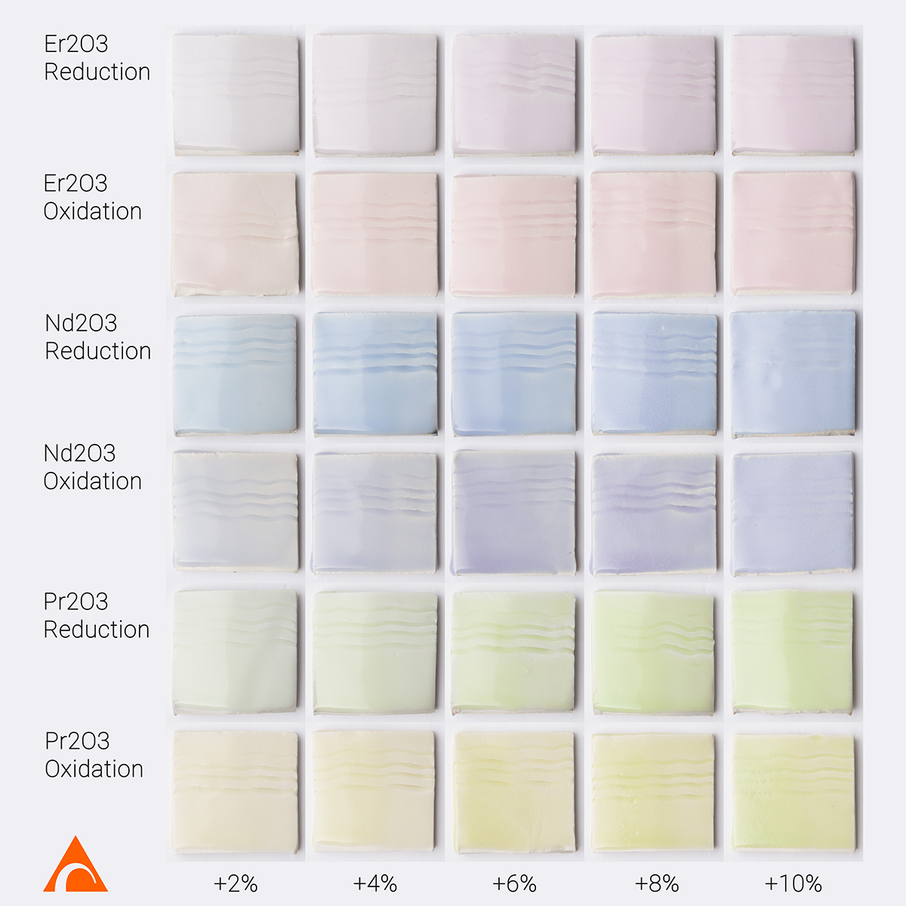

Line blends of Erbium Oxide, Neodymium Oxide, and Praseodymium Oxide in a clear glaze base (Mahavir Clear) fired to Orton cone 10 in both oxidation and reduction atmospheres. All recipes and photos available on https://glazy.org

https://www.instagram.com/p/BwAzxC-gZIn/
