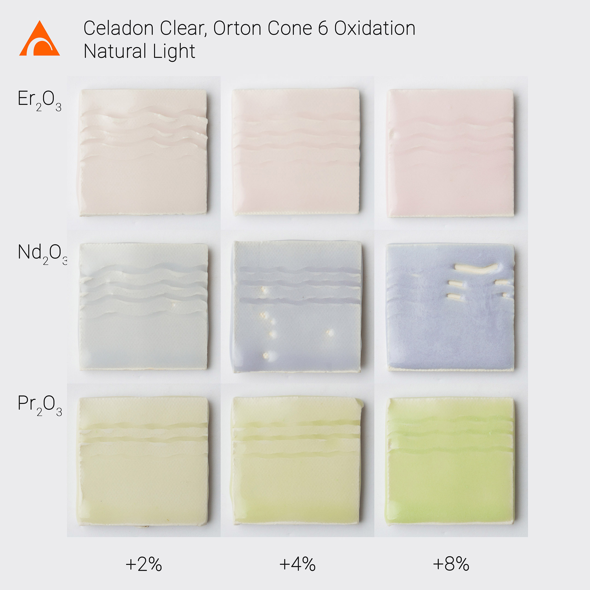
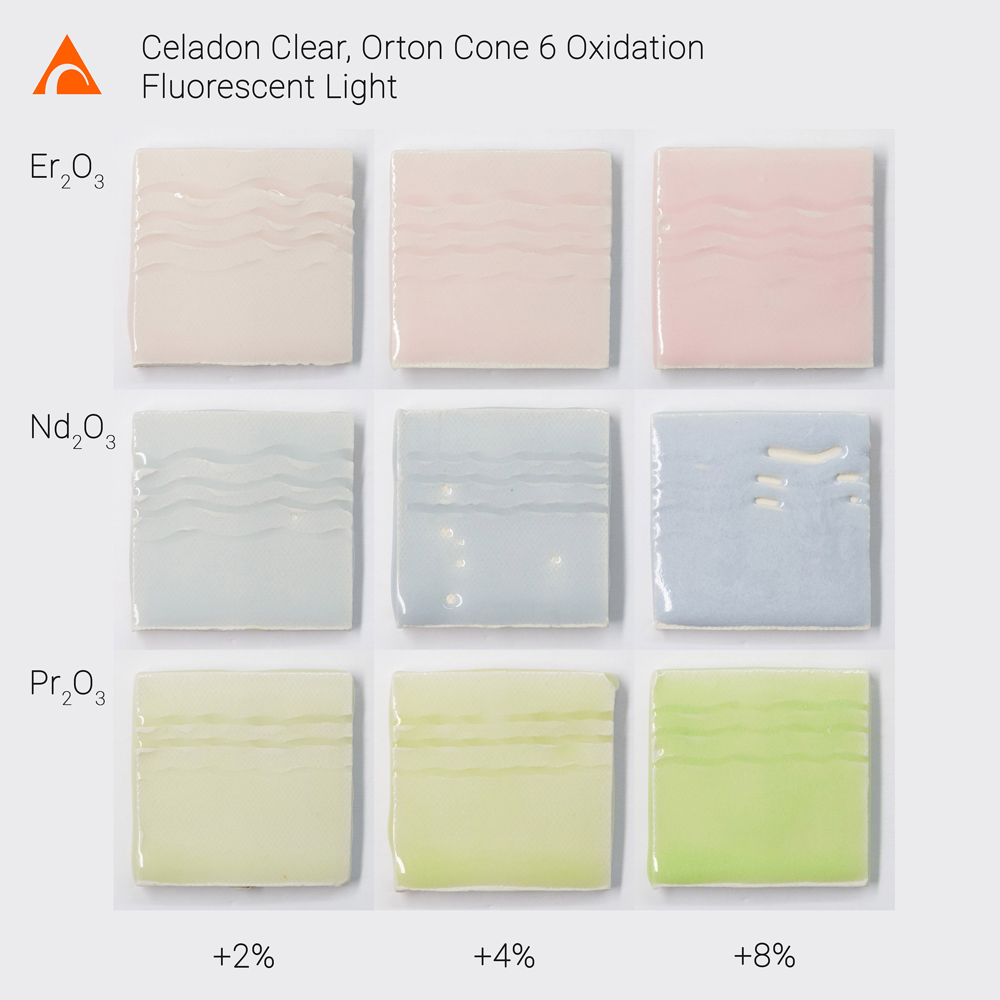

Some of your requested my previous tests of Erbium Oxide, Neodymium Oxide, and Praseodymium Oxide in Oxidation at Orton Cone 6.

Here are tests using my Cone 6 base, Celadon Clear, on Standard [#551](https://www.instagram.com/explore/tags/551/) porcelain.  Two sets of photos, one in natural window light and the other in fluorescent light with appropriate adjustments to white balance.  The color differences between light sources are more prominent in person.  All recipes and photos available on https://glazy.org

[@ceramicmaterialsworkshop](https://www.instagram.com/ceramicmaterialsworkshop/) just posted some excellent tests by [@laura\_rainbowyoda](https://www.instagram.com/laura_rainbowyoda/) showing the influence of different Alkaline Earth Fluxes on the color and quality of glazes with Rare Earth additions.

https://www.instagram.com/p/BwRhZR0AkMG/
