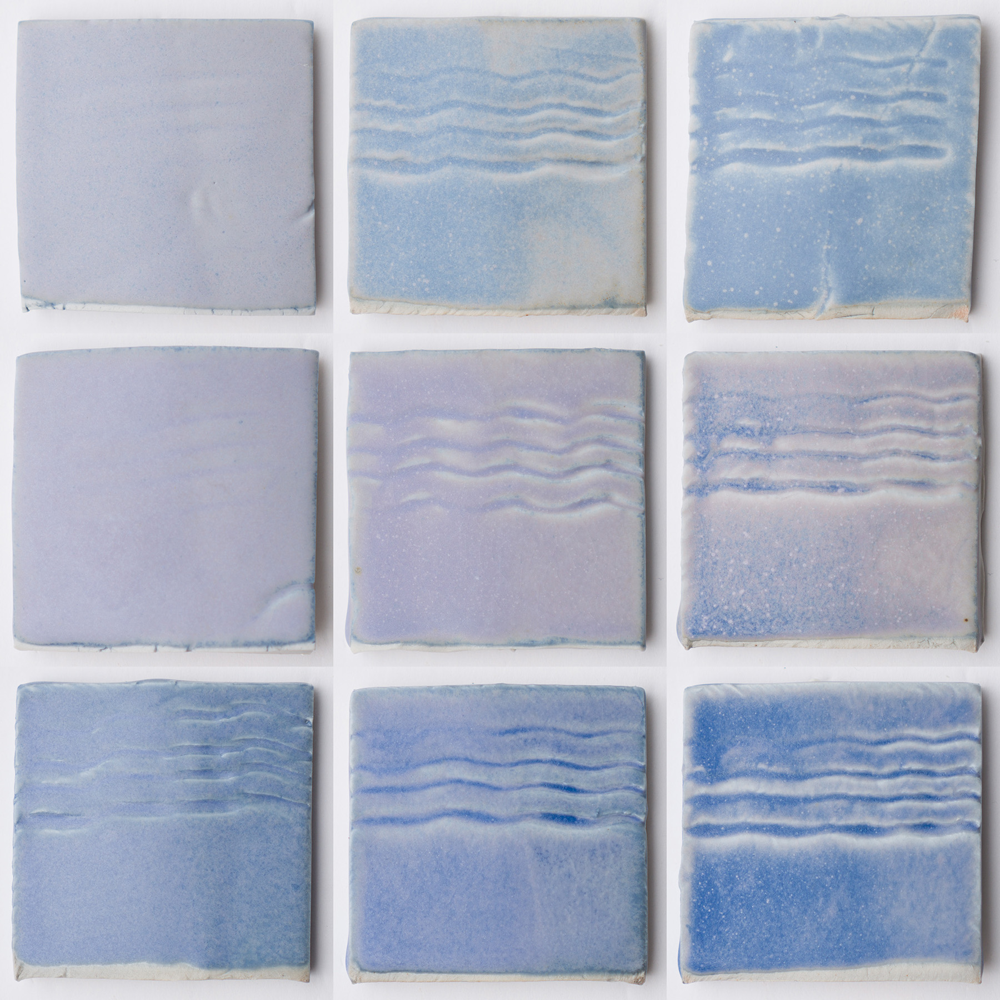

Creating a small Si:Al biaxial test to "fine-tune" a recipe, in this case Reitz Purple.  
Using the Glazy calculator, four "corner" recipes were created.  Volumetric blending using a syringe was used to create the intermediary glazes.  Tests fired to Orton Cone 10 in both oxidation and reduction.  For more information, see: https://glazy.org/u/derekau?collection=11075

Cone 10 Reduction:

Cone 10 Oxidation:

[#glaze](https://www.instagram.com/explore/tags/glaze/) [#glazes](https://www.instagram.com/explore/tags/glazes/) [#glazerecipes](https://www.instagram.com/explore/tags/glazerecipes/)[#glazetest](https://www.instagram.com/explore/tags/glazetest/) [#ceramics](https://www.instagram.com/explore/tags/ceramics/) [#pottery](https://www.instagram.com/explore/tags/pottery/)[#ceramicglazes](https://www.instagram.com/explore/tags/ceramicglazes/) [#glazechemistry](https://www.instagram.com/explore/tags/glazechemistry/)[#glazechem](https://www.instagram.com/explore/tags/glazechem/) [#glazecalc](https://www.instagram.com/explore/tags/glazecalc/) [#glazy](https://www.instagram.com/explore/tags/glazy/)

https://www.instagram.com/p/Bw9rQw7j9j7/
