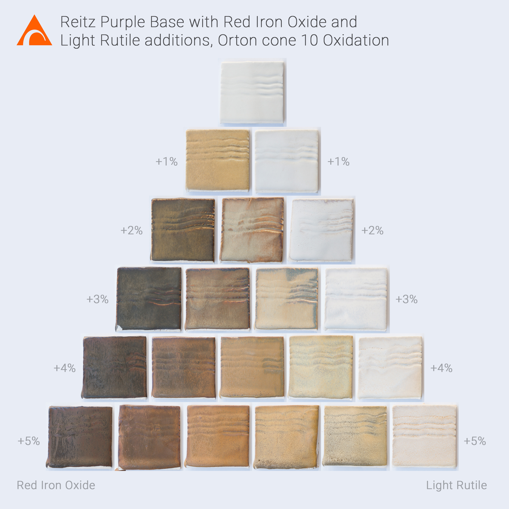
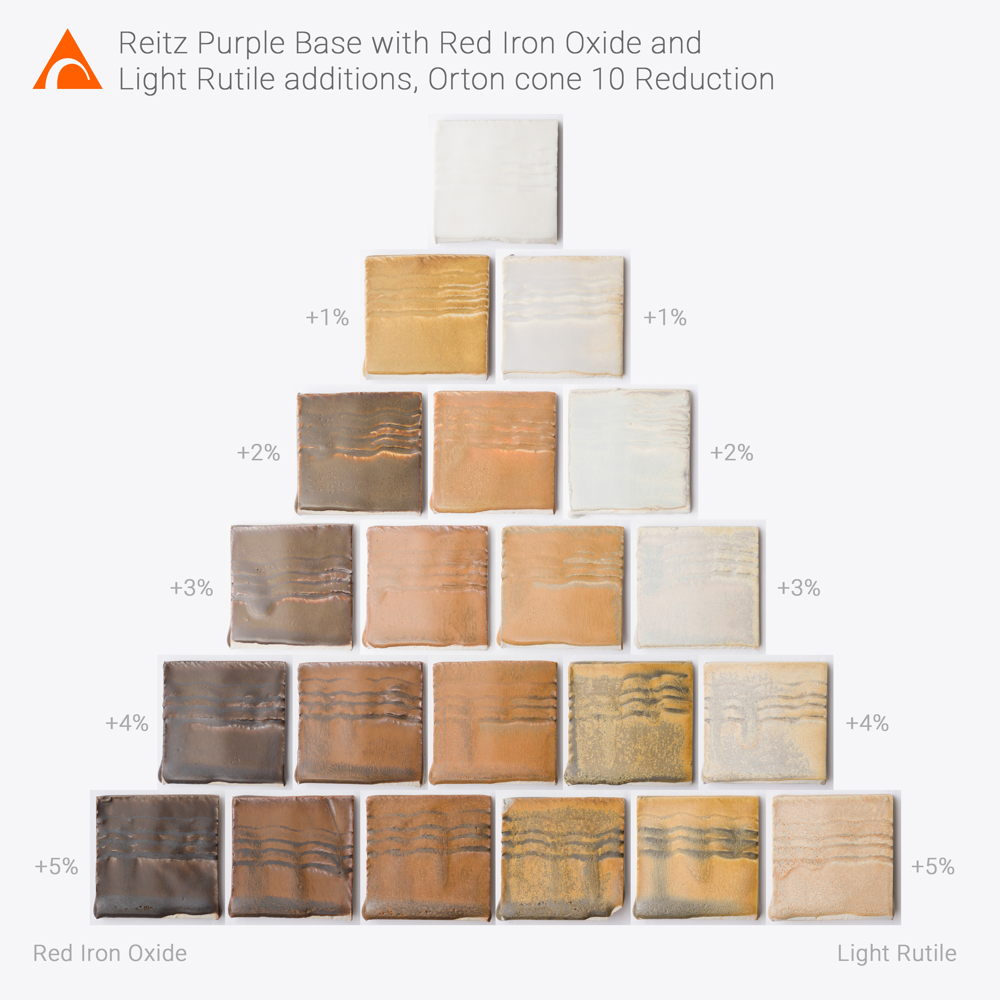

## Oxidation

## Reduction 

A triaxial blend using Reitz Purple base with additions of Red Iron Oxide and Light Rutile.  Fired to Orton Cone 10 in both oxidation and reduction.  The most interesting tests are the intermediary glaze containing both iron and rutile.

https://www.instagram.com/p/BxAYaYAAlrQ/
