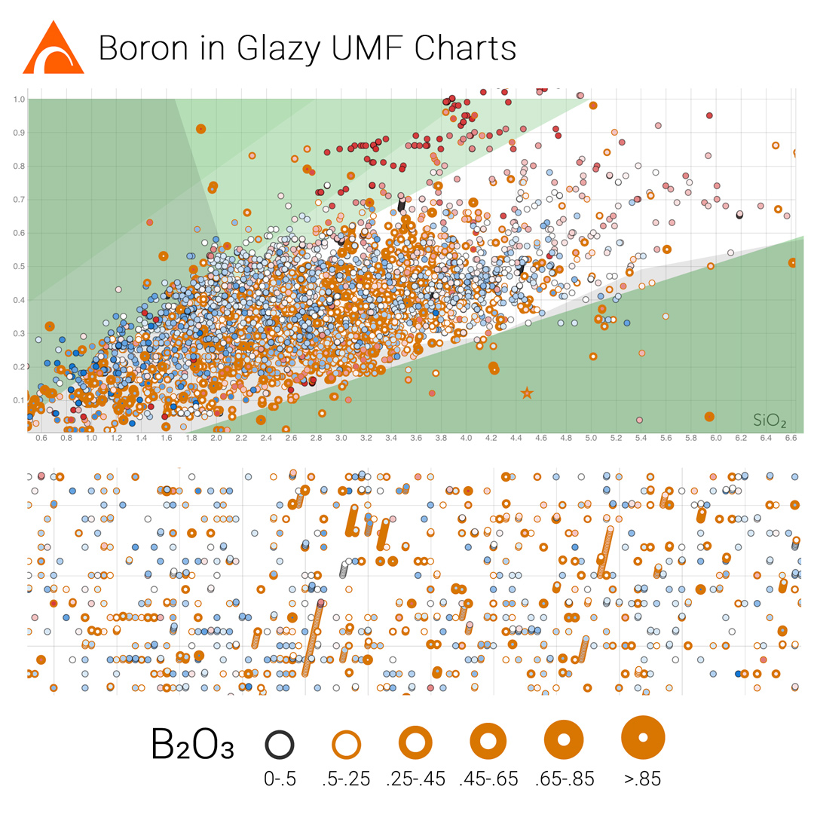

Chart points are now outlined in orange if they contain B2O3.  Outline thickness signifies amount of Boron (see legend in image). Hovering over a chart point will show the exact B2O3 amount (if any).

[https://derekphilipau.github.io/vue-d3-stull-charts/](https://derekphilipau.github.io/vue-d3-stull-charts/)

https://www.instagram.com/p/By78tnlAeSi/
