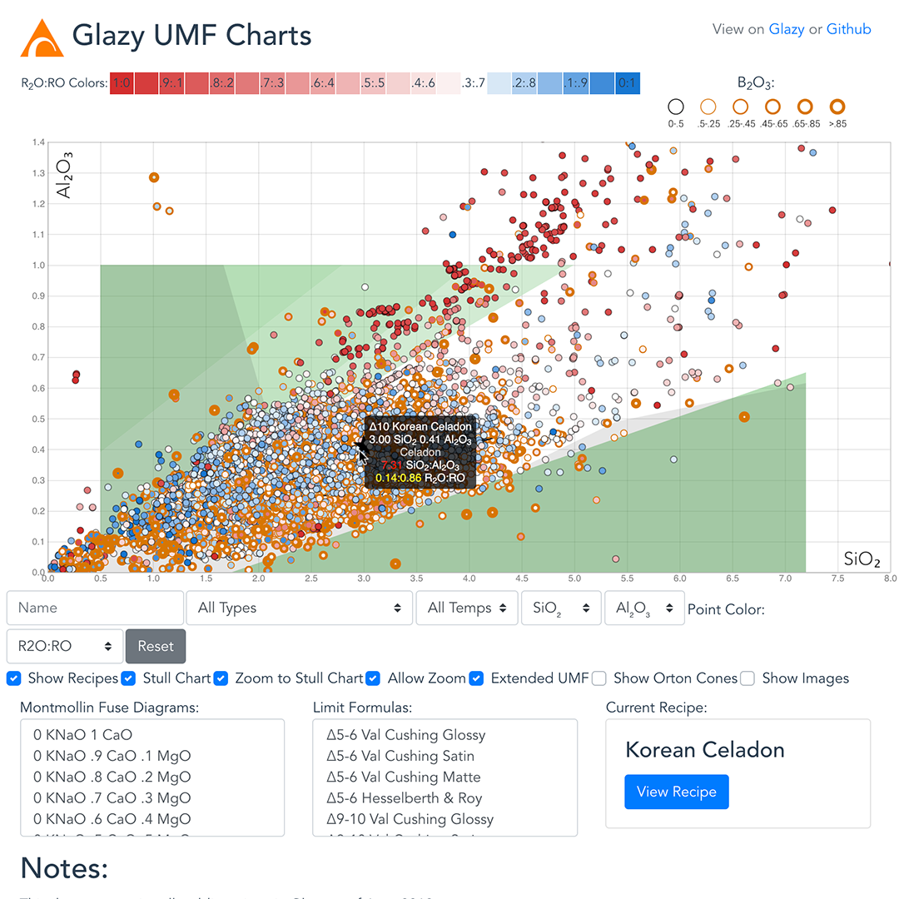
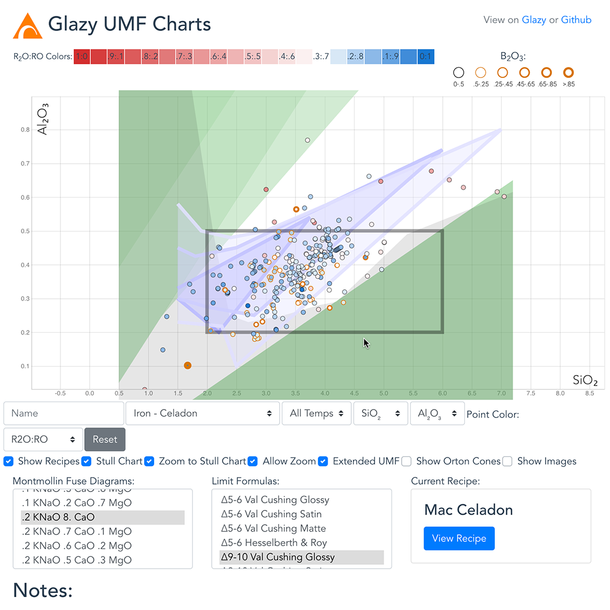

Explore all public Glazy recipes in an interactive chart.  Filter by name, glaze type and temperature.  Change the axes from Si:Al to any combination of oxides.  View common Limit Formulas and Montmollin Fuse Diagrams.  Download the entire dataset in JSON or CSV format. (Note that this is a heavy website with a large amount of data that will probably not work well on mobile.)

[https://derekphilipau.github.io/vue-d3-stull-charts/](https://derekphilipau.github.io/vue-d3-stull-charts/)

https://www.instagram.com/p/BzAtz7ogaGu/
