#### "Export" Art

During the 18th Century, Guangdong province was the hub for trade with the West. The dialogue between Western merchants and artists with both painters and porcelain producers resulted in a unique blend of Chinese and Western styles. This blend was reflected in the painting styles for both Export Paintings as well as Export Ceramics (specifically, Canton Porcelain or _guangcai_).

_Note: Christies has a wonderful online exhibition regarding the dialogue between East and West and how it influenced both painting and porcelain decoration: ["East greets West — the pictorial legacy of the China Trade"](https://www.christies.com/features/The-pictorial-legacy-of-the-China-Trade-9505-1.aspx)_

Of particular interest to ceramicists are sets of Export Paintings that detailed traditional Chinese porcelain-production techniques. The basis for these paintings can be traced back to a set of illustrations of porcelain production made in the Qianlong reign and annotated by Tang Ying, the Superintendent of the Imperial porcelain works in Jingdezhen who was hugely influential in the development of Chinese ceramics. (There's a good translation of this work on [http://gotheborg.com](http://gotheborg.com/): [Twenty Illustrations of the Manufacture of Porcelain](http://gotheborg.com/twentyillustrations/tangyingindex.shtml))

Perhaps copies of copies of copies, these sets of Export Paintings that detail porcelain production have some obvious flaws, and titles and characters are often wrong. (For example, using 油 instead of 釉.) Furthermore, it's apparent that Guangdong had a different vocabulary for various aspects of the porcelain craft, as the words used in these paintings often differ from descriptions of ceramics production written in Jingdezhen and Tang Ying. It's highly doubtful that anyone involved in the production of these paintings had ever themselves visited Jingdezhen and documented porcelain craft first-hand. Regardless, these paintings contain some very interesting details of porcelain production while also serving as examples of cross-cultural exchange. (In this case, exchange not only between the West and East, but between Jingdezhen and Guangdong.)

* * *

## Victoria and Albert Museum

Here's a lovely set of Guangzhou Chinese export paintings from the V&A. The original set contained 24 paintings but I've only found 22 on the V&A website.

[There's no direct link to the set of paintings, but you can click here to search for them on the V&A website.](https://collections.vam.ac.uk/search/?listing_type=imagetext&offset=0&limit=45&narrow=1&extrasearch=&q=porcelain+painting+guangzhou&commit=Search&quality=0&objectnamesearch=&placesearch=&after=&before=&namesearch=&materialsearch=&mnsearch=&locationsearch=)

**All Images Copyright © Victoria and Albert Museum, London**

#### Mining Porcelain Stone

I'm not sure if the painter ever actually visited Jingdezhen. All of the porcelain stone mines I've ever come across are in the mountains :) This mine seems to be located perilously close to rice paddies and a river.

#### Breaking Porcelain Stone With Water-Powered Trip Hammers

This is a more realistic depiction than the previous painting. The porcelain hammers rely on a watermill for power (rather than a Japanese _Sōzu_\-type water hammer). The hammer action is slow but continuous, resounding throughout the surrouding countryside.

#### Oxen Treading Porcelain Stone in Pits

#### Digging China Clay

China clay, or Kaolin, was originally named for a mountain in the countryside near Jingdezhen- Gaolingshan (高岭山).

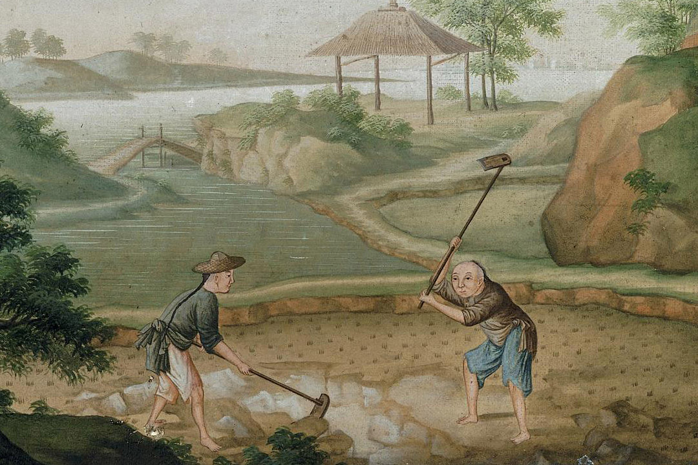

#### Men Washing China Clay in Pits

Here the china clay is being washed and agitated using water from a nearby lake. The clay is gradually purified through a process of levigation.

#### Making Basins

Note that the thrower is assisted by an apprentice who's job is to help turn the potter's wheel. Another assistant removes each freshly thrown basin and then adds new clay to the wheel head.

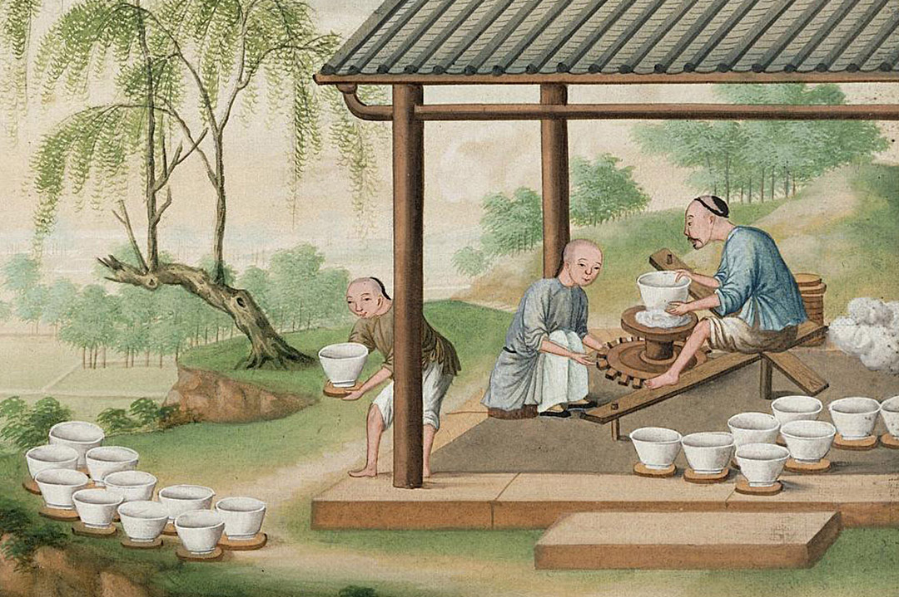

#### Making Vases

#### Shaping Outsides and Footrims of Bowls

Apparently this represents trimming down of the previously thrown form, although missing in the picture is a mound of trimmings next to each potter's wheel.

#### Potters Painting in Underglaze Blue

#### Potters Painting Bowls in Underglaze Blue (Maybe)

#### Preparing Glaze

#### Applying Glaze

Most glazing is done by dipping the unfired porcelain into a bucket of glaze.

#### Stacking the Kiln

The decorated and glazed porcelain is carefully arranged into saggars, which are then placed in stacks in the kiln.

#### Chopping Wood and Stocking the Kiln

Firing the kilns was a continuous process of cutting wood and feeding pieces to the kiln.

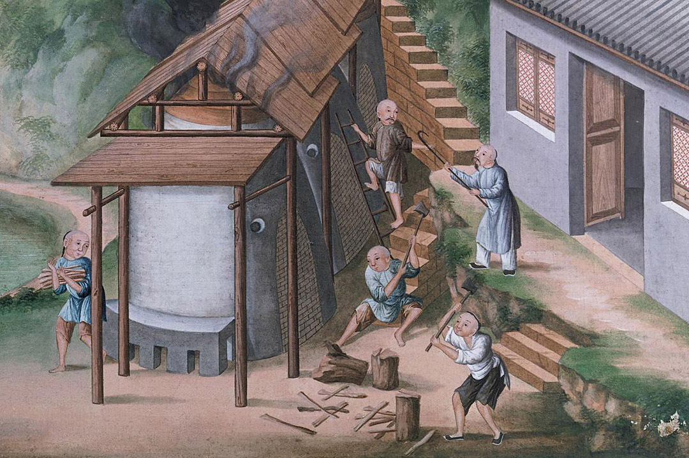

#### Unloading the Kiln

#### Potters Painting in Enamel Colours

Note that the on-glaze enamel painters each have a set of enamels in different colors placed in saucers at their work table.

#### Firing Enamelled Ware in Muffle Kiln

This is a "明炉", somewhat similar to a pizza oven. It is used to fire overglaze enamels, which require a much lower temperature (approximately 800°C) than the previous high-temperature glaze firing (approximately 1300°C). Each piece of porcelain is placed on a specialized tool, and then placed into the oven and cooked until the enamels are sufficiently melted.

#### Wrapping Porcelain in Rice Straw and Packing in Wooden Tubs

Traditional Chinese techniques for packing and shipping porcelain deserve an entire article or book for themselves. Suffice it to say that these techniques were refined over centuries, resulting in a method that resulted in the least possible amount of broken wares. The large wooden barrels were specifically crafted just for the purpose of shipping porcelain.

#### Transport of Porcelain Overland

Transportation of the finished porcelain was an arduous journey, going over both land and water in multiple stages depending upon the final destination.

#### Transport of Porcelain by River

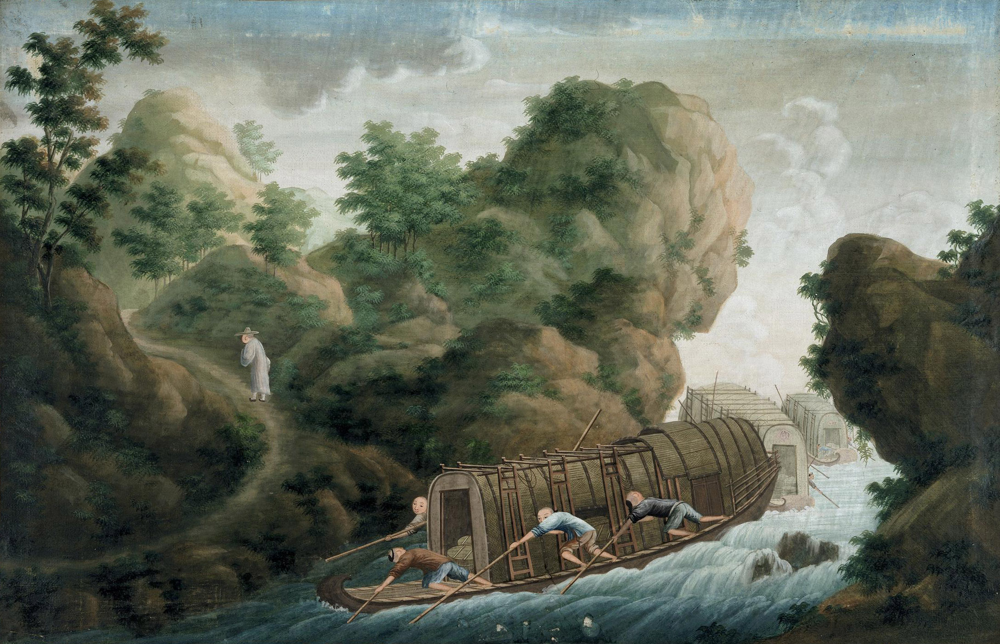

#### Porcelain Arriving at Canton Warehouse

#### Porcelain Shop in Canton

* * *

## Hong Kong Maritime Museum: Trading China

The Hong Kong Maritime Museum has a very nice exhibit of export watercolor paintings documenting traditional porcelain production in China. [Visit the Google Arts & Culture Exhibit by clicking here.](https://artsandculture.google.com/exhibit/FwJCJRLkf2CoIQ)

**All Images Copyright © The Hong Kong Maritime Museum**

(Note: I've added some missing images using an identical set of paintings from a Christies auction: "[A Chinese export album depicting the manufacture and distribution of porcelain](https://www.christies.com/lotfinder/Lot/a-chinese-export-album-depicting-the-manufacture-5541072-details.aspx)"

#### Mining and preparing China Clay (Kaolin) “炼土”

#### Buffalo trampling the China Clay “踏土”

#### Washing China Clay

#### Sieving China Clay “筛土”

#### Mining porcelain stone “凿土”

There's no distinction made in the painting titles of Kaolin (China Clay) vs. Porcelain Stone, everything is just called "dirt" ("土").

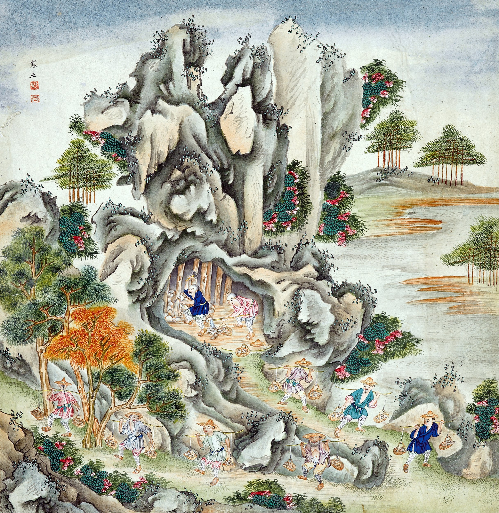

#### Crushing porcelain stone with a water wheel “椿土”

#### Moulding the porcelain stone into bricks (_baidunzi_) “印土”

#### Transporting porcelain stone bricks “卖土”

#### Throwing bowls on the wheel “车胎”

#### Trimming bowls “修胎”

#### Glazing the unfired ware “荡釉”

#### Cutting firewood for the kilns “据柴”

#### Stacking the kiln with saggars “装窑”

#### Firing the kiln with a constant supply of wood “烧窑”

#### Unpacking the fired kiln “出窑”

#### Applying overglaze enamels to the fired ware “斗彩”

_doucai_ is a popular technique perhaps best known because of the [famous "Chicken Cup"](http://www.sothebys.com/en/auctions/2014/meiyintang-chicken-cup-hk0545.html). _doucai_ combines the blues of blue & white underglaze decoration (_qinghua_) with colorful overglaze enamels.

#### More on-glaze enamel painting (_falangcai_) “珐琅”

Artisans using imported Western overglaze enamels (_falangcai_, _yangcai_, _famille rose_) to decorate porcelain.

#### Firing the overglaze enamels “明炉”

This is a more realistic depiction of the _ming lu_ (明炉) than in the V&A painting, as it also shows porcelain being pre-heated on coals in preparation for being placed into the hot oven.

#### Refiring in a closed stove “暗炉”

The _an lu_, or enclosed "dark" kiln is also used for firing overglaze enamels. Ware is placed inside a large, saggar-like enclosure that is then surrounded with a layer of kiln bricks. Hot coals are placed in the space between the inner and outer layers. Spacer bricks at the bottom of the kiln ensure a constant supply of fresh oxygen.

#### Packing bowls in straw

#### Making wooden barrels for porcelain transport “箍桶”

#### Packing the finished porcelain in barrels “装桶”

#### Crossing Poyang (Boyang) Lake “过滩”

#### Crossing mountain pass “过岭”

#### A Chinese merchant travels to Jingdezhen “出装”

#### Taking orders “定货”

#### European merchants at a porcelain shop “开铺”

#### The purchaser pressing for delivery “催货”

#### A porcelain dealer’s banquet “请酒”

#### The purchaser bids farewell to the vendor as he starts his journey to the south “送客”

#### A porcelain commission is brought to Raozhou “饶州”

#### Making offerings to the god of fortune “发财”

* * *

## Hong Kong Maritime Museum Hand Scroll

Also from the Hong Kong Maritime Museum, ["A handscroll painting of the porcelain production process, early 19th century"](https://artsandculture.google.com/asset/a-handscroll-painting-of-the-porcelain-production-process-early-19th-century-left-half/fAHU6XhS4fSAuQ). This scroll is quite long and difficult to view in a web browser, so I have also included cropped details. Keep in mind the scroll is "read" from right to left.

**All Images Copyright © The Hong Kong Maritime Museum**

The entire scroll.

Right half of hand scroll.

Left half of hand scroll.

Digging Kaolin (China Clay) from the mountain.

Making clay saggars and throwing bowls.

I'm not sure whats going on here, perhaps joining pieces to make larger forms?

Painting underglaze blue & white on unfired porcelain bowls.

Applying glaze by spraying and dipping.

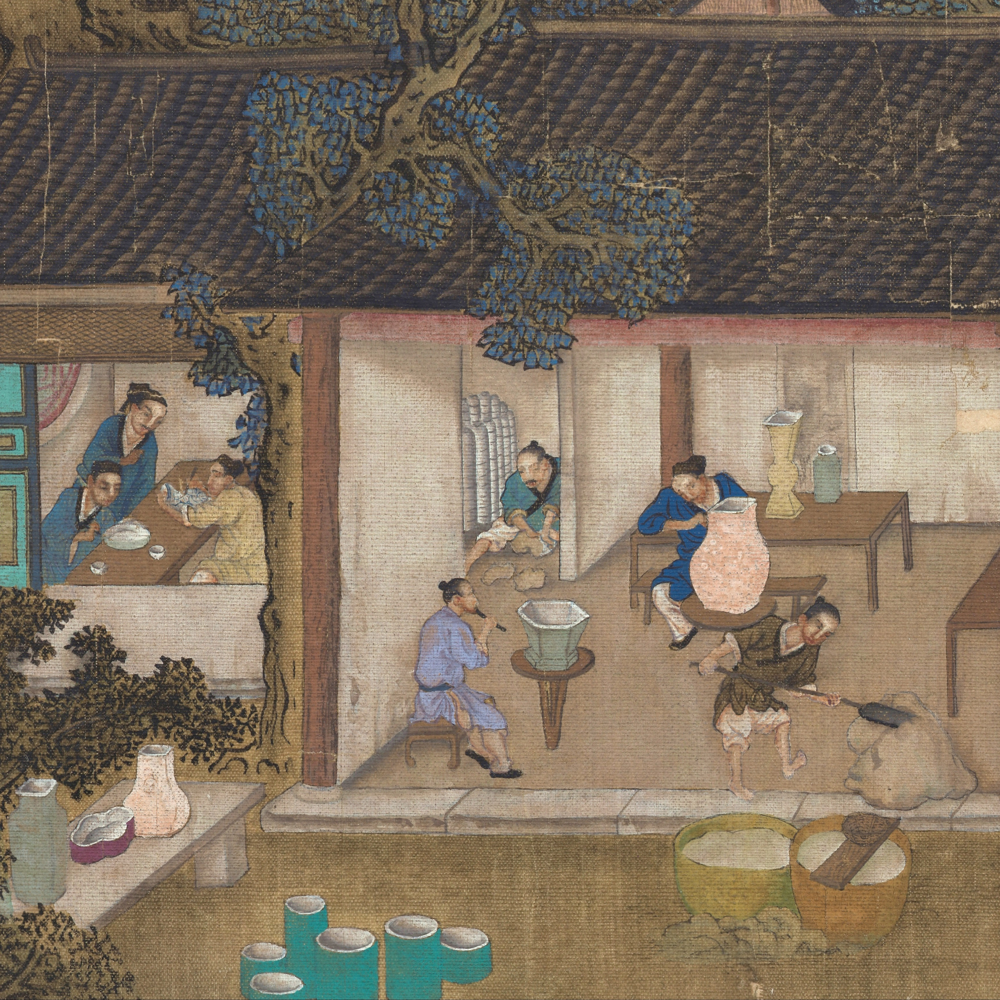

Construction of slab-built forms.

Grinding pigments and decorating ware.

* * *

## The British Museum

These images are released under the Creative Commons [Attribution-NonCommercial-ShareAlike 4.0 International](http://creativecommons.org/licenses/by-nc-sa/4.0/) (CC BY-NC-SA 4.0) license. You can read more about the British Museum and Creative Commons [here](https://www.britishmuseum.org/about_this_site/terms_of_use/copyright_and_permissions.aspx).

[Direct link to images on the British Museum website.](https://www.britishmuseum.org/research/collection_online/collection_object_details/collection_image_gallery.aspx?partid=1&assetid=144694001&objectid=269902#more-views)

#### “山取泥”

#### “水椎椿泥”

#### “蹴泥”

#### “椎泥车坯”

#### “过坯”

#### “车大坯”

#### “车大缸坯”

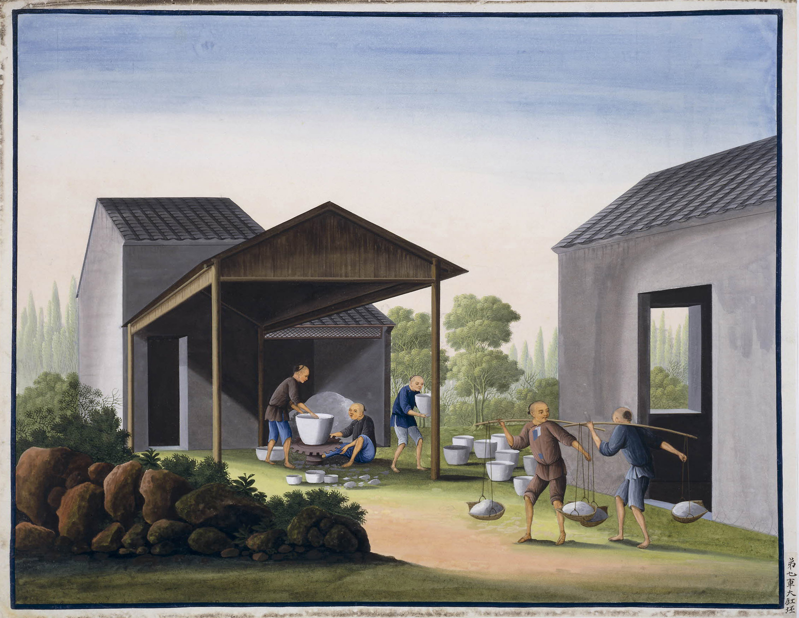

#### “作玩器坯”

#### “修坯晒坯”

#### “磁器 采写”

#### “挂白色釉”

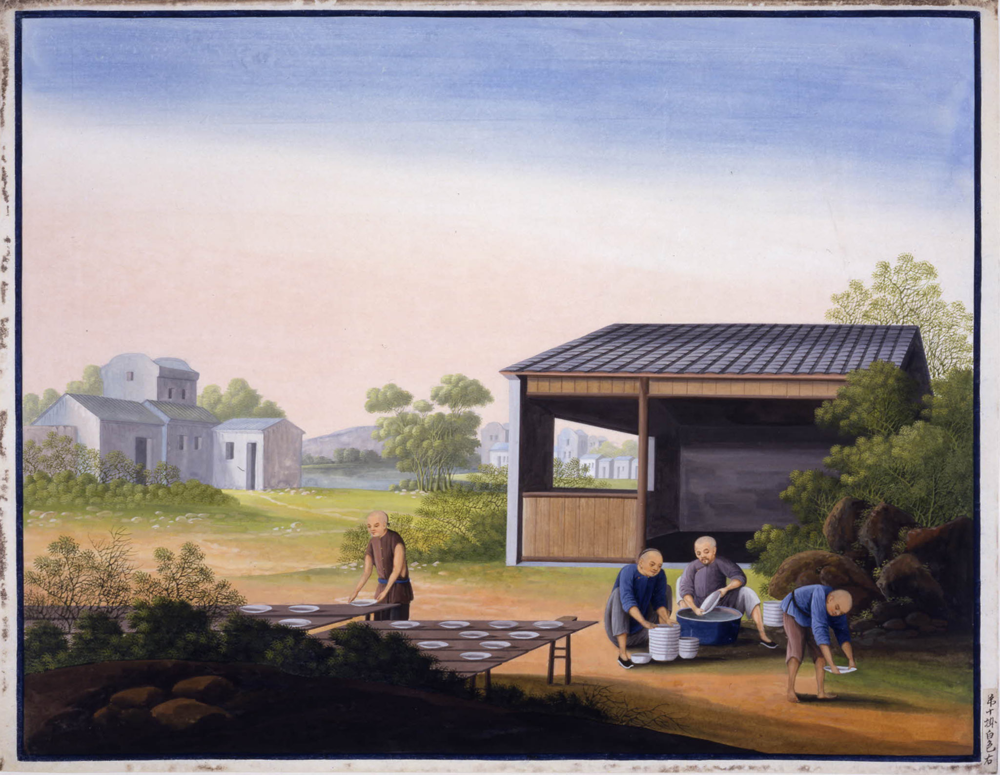

#### “磁器 过油（釉）”

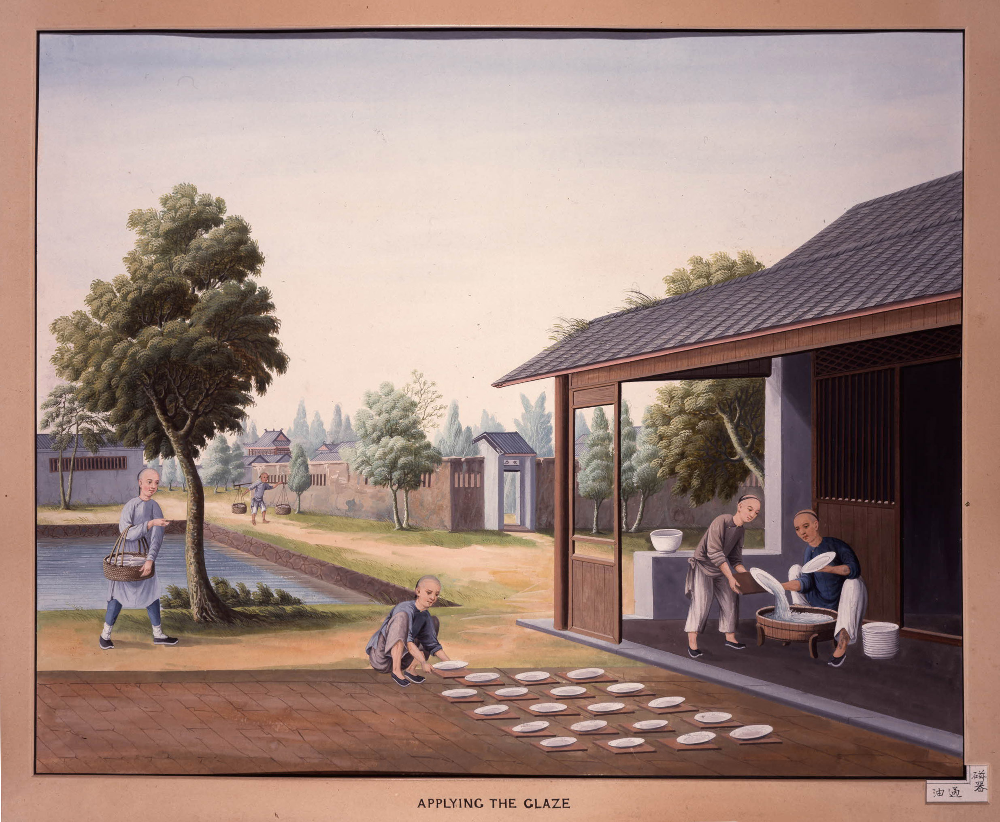

#### “挂杂色釉”

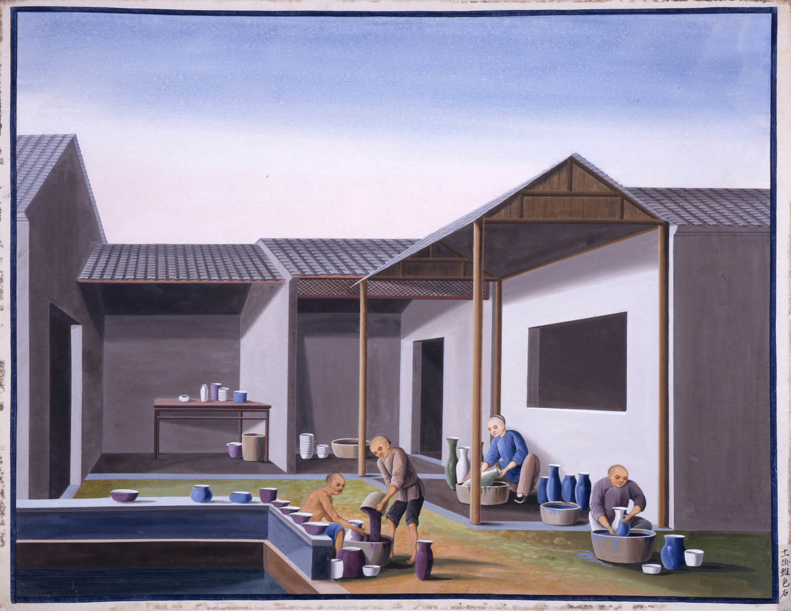

#### “收货”

#### “入窑”

#### “出窑洗磁器”

#### “焙磁器”

#### “写磁器”

#### “局磁器”

#### “起全”

#### “卖磁器”

#### “扎磁器”

#### “落桶”

#### “磁器 过山”

#### “出货”

#### “过山岭”

#### “到广东装箱”

#### “磁器 装”

* * *

## Christies

CHINESE SCHOOL, EARLY 19TH CENTURY  
_Porcelain Production, A Set of Four_  
Depicting four stages in the production of porcelain:  
Shaping bowls on a kick-wheel  
Perfecting the shape  
Glazing the wares  
Packing the finished wares  
oil on canvas

* * *

## Christies

[CHINESE SCHOOL, CIRCA 1800, PORCELAIN PRODUCTION SCENES, A PAIR](https://www.christies.com/lotfinder/Lot/chinese-school-circa-1800-porcelain-production-scenes-5865736-details.aspx)

* * *

## Sotheby's

[TEN 'PORCELAIN PRODUCTION' GOUACHE PAINTINGS CIRCA 1800](http://www.sothebys.com/en/auctions/ecatalogue/lot.427.html/2014/fine-chinese-ceramics-works-of-art-n09116)

* * *

## Sotheby's

[CHINESE SCHOOL: SIX SCENES OF PORCELAIN PRODUCTION  
19TH/20TH CENTURY](http://www.sothebys.com/en/auctions/ecatalogue/lot.287.html/2010/chinese-export-porcelain-from-the-private-collection-of-elinor-gordon-n08650)

Digging and washing China Clay (kaolin)

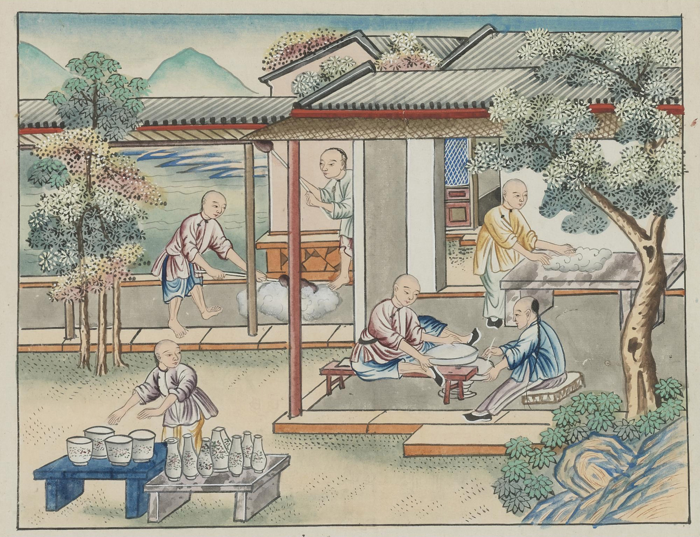

Preparing porcelain clay (beating and kneading), throwing dishes, and drying ware.

Beating porcelain clay and throwing dishes.

Grinding underglaze pigments, decorating porcelain vases and glazing.

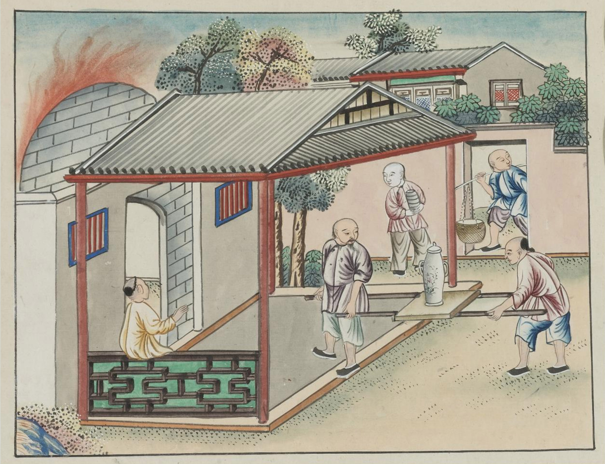

Transporting unfired ware to a kiln.

Firing low-fire enameled porcelain in a _ming lu_ kiln.
