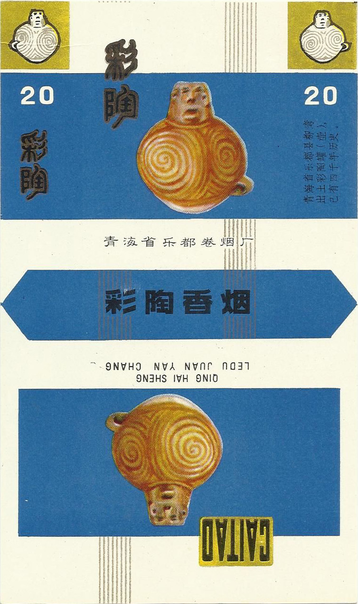
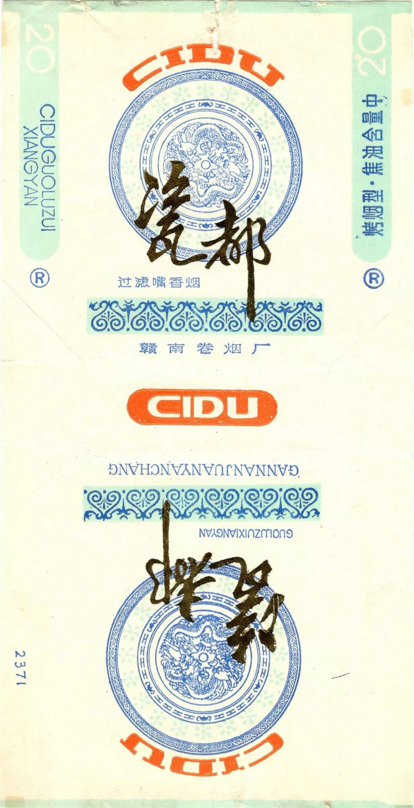
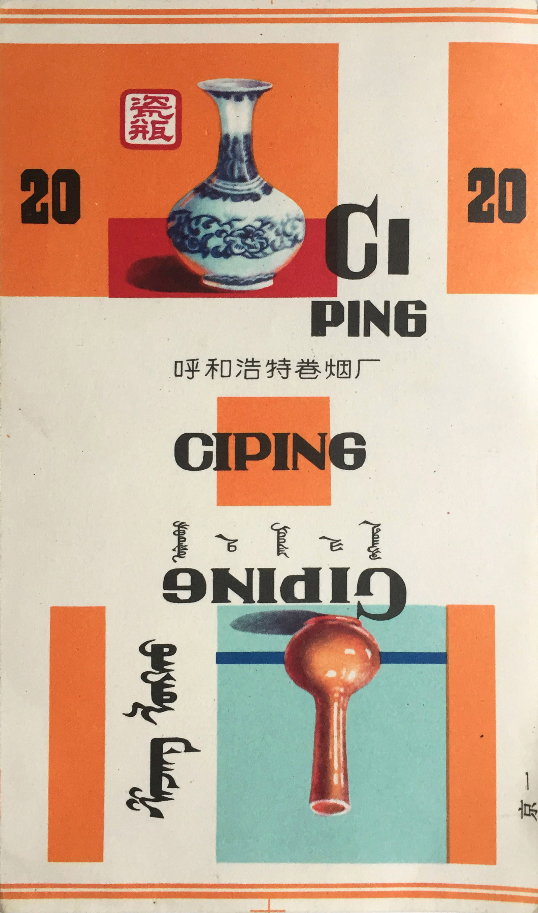
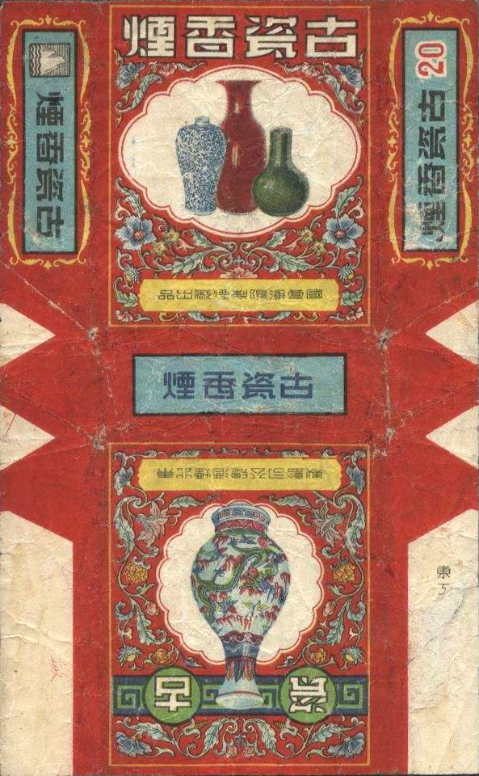
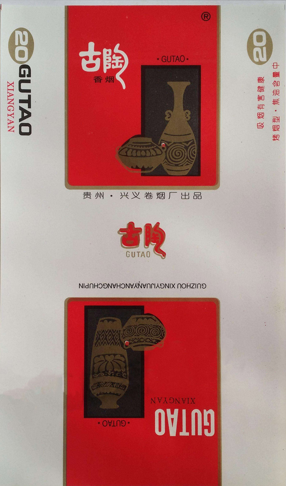
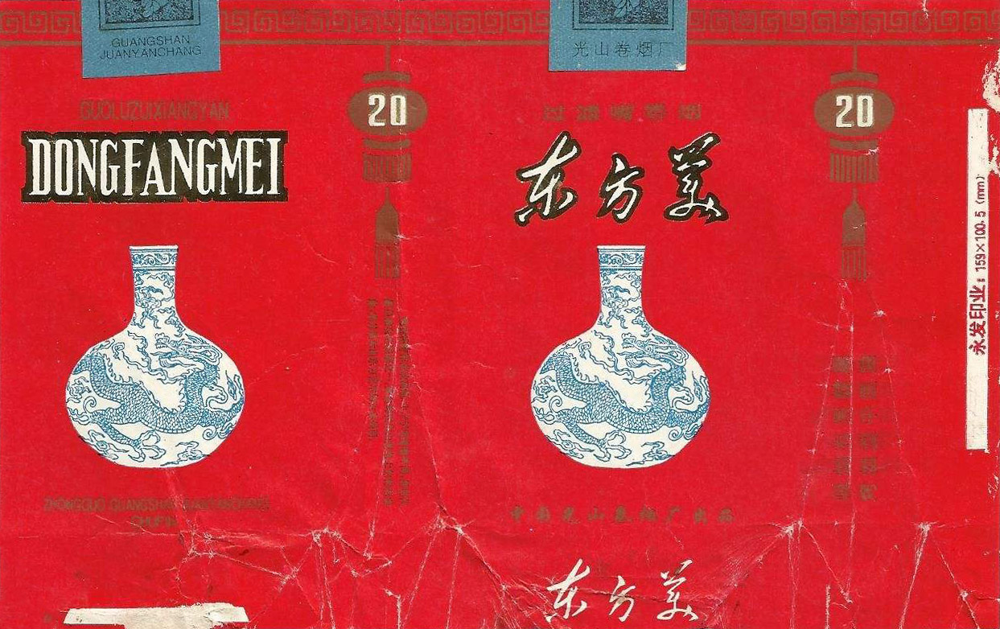
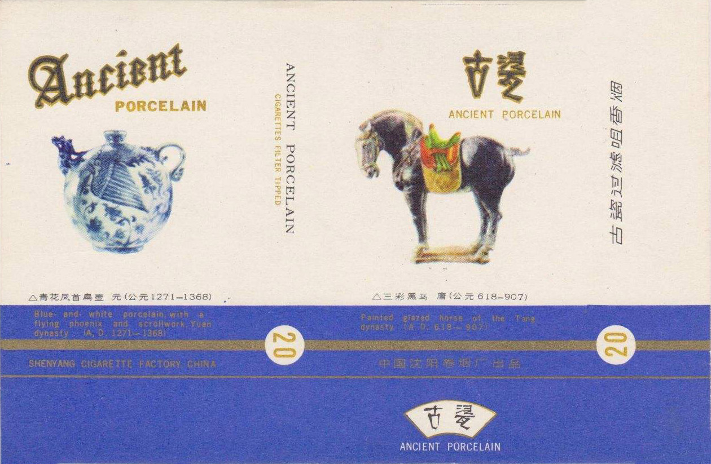
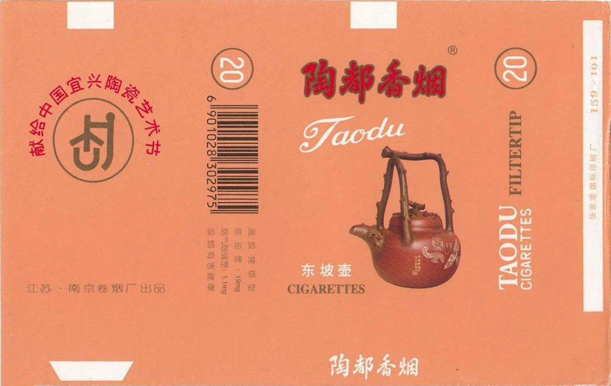
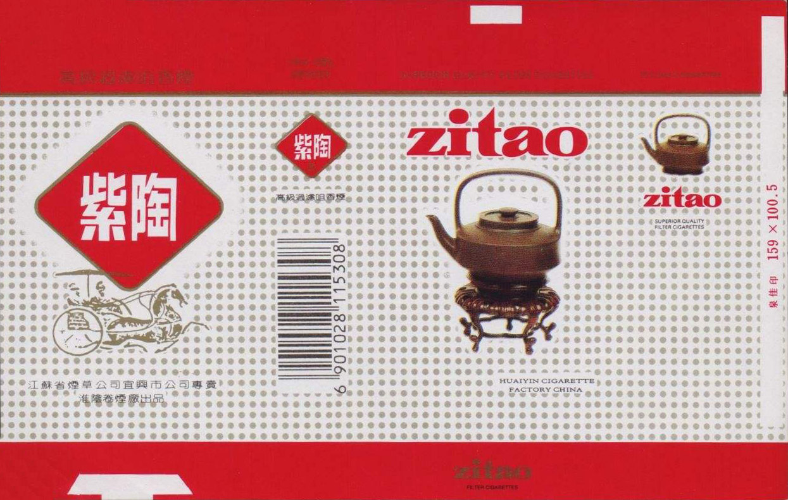

Celebrating ancient Chinese ceramics in vintage cigarette labels:

1\. "Painted Pottery" honoring neolithic pottery from the Yangshao culture.

2\. Named for Jingdezhen, "Ceramic Capital", and produced in Jiangxi.

3\. “Porcelain vase" cigarettes from Hohhot in Inner Mongolia.

  
4\. "Ancient Ceramics" with four representative types of Chinese porcelain.

  
5\. "Ancient Pottery" from Guizhou Province.

  
6\. “Sancai" cigarettes, paying tribute to Tang Dynasty three-colored ware.

7\. Dongfangmei, featuring a blue & white qinghua vase.

8\. "Ancient Porcelain", also with a Tang Dynasty horse sculpture.

9\. Famous for purple clay teapots, Yixing is also known as the "Pottery Capital".

10\. "Purple Pottery", showing a teapot from Jianshui in Yunnan.

