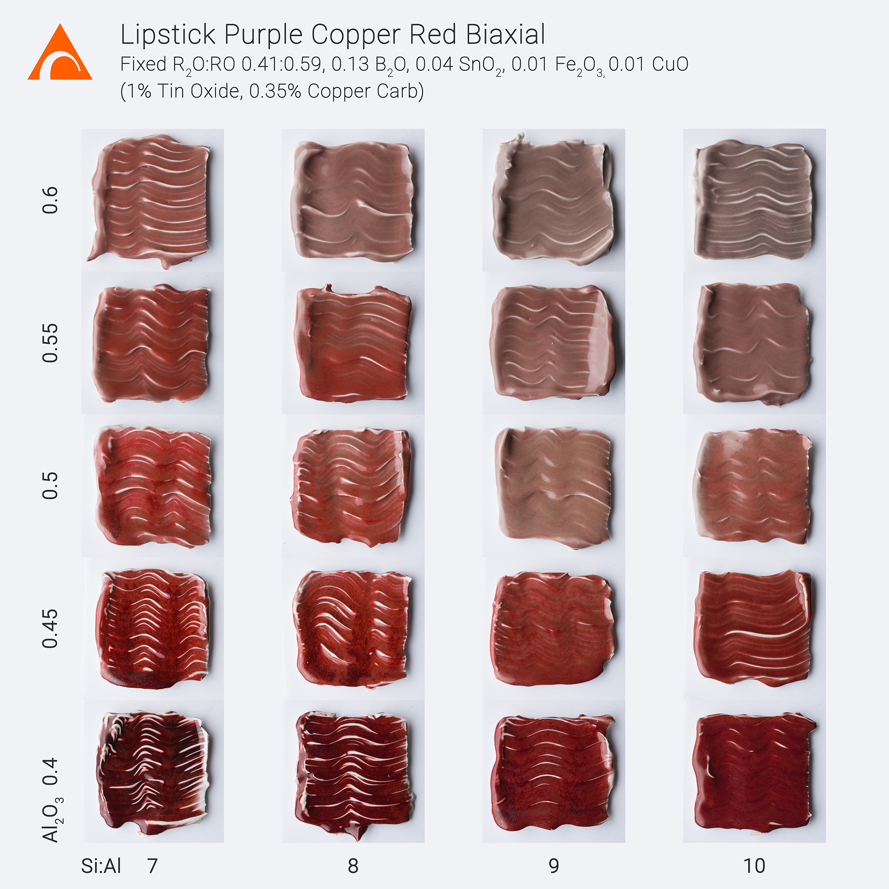
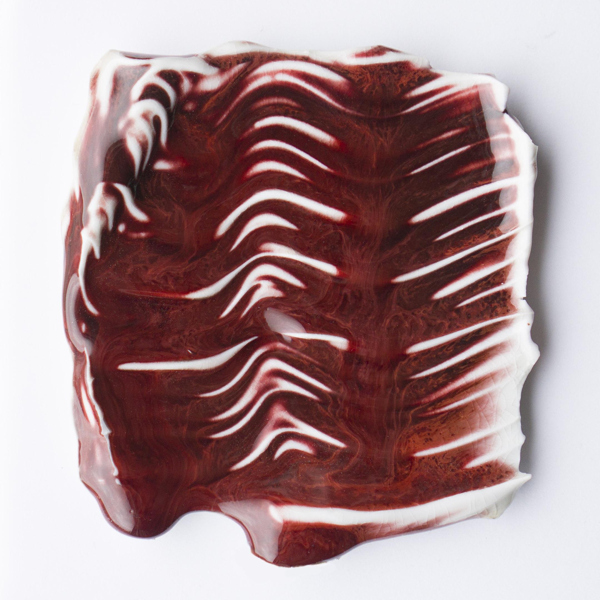

"Painted" Biaxial based on Tom Coleman's beautiful Lipstick Purple.

Part of my "Painted" series of tests prepared for @northernclaycenter's "Six McKnight Artists" exhibition.  Each row has a set Alumina level, while each column represents a specific Silica:Alumina ratio.  Coleman's original recipe lies on the bottom row (Al2O3 0.4) between the second & third columns (Si:Al 8.4). 

This close-up tile is bottom left corner (Al2O3 0.4, Si:Al 7).

Lipstick Purple:

[https://glazy.org/recipes/33836](https://glazy.org/recipes/33836)

Six McKnight Artists:

[https://www.northernclaycenter.org/exhibition/six-mcknight-artists-5](https://www.northernclaycenter.org/exhibition/six-mcknight-artists-5)
