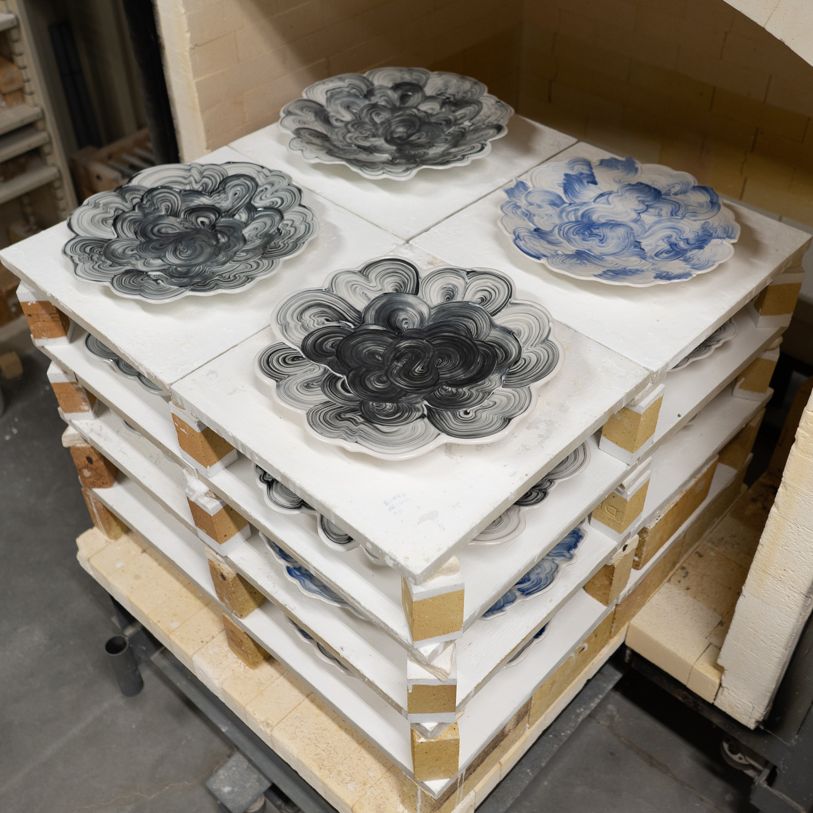

Montana implements shelter-in-place today. I unloaded my last kiln a couple days ago, and have set up my glaze materials in the garage. Intending to make tests that I hope to fire after quarantine ends.
